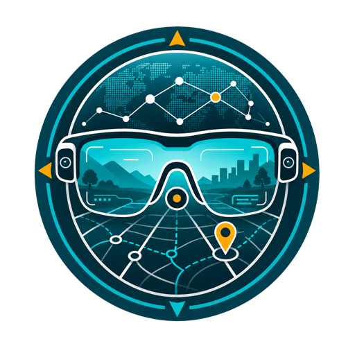

  <a href="README.md">English</a> ·
  <a href="README.zh.md">中文</a> ·
  <a href="README.es.md">Español</a> ·
  <a href="README.fr.md">Français</a> ·
  <a href="README.de.md"><b>Deutsch</b></a> ·
  <a href="README.ja.md">日本語</a> ·
  <a href="README.ko.md">한국어</a> ·
  <a href="README.pt.md">Português</a> ·
  <a href="CONTRIBUTING.md">Beim Übersetzen helfen</a> ·
  <a href="https://chaoyue0307.github.io/awesome-egocentric-atlas/">Startseite</a> ·
  <a href="https://huggingface.co/datasets/cy0307/awesome-egocentric-atlas">Hugging-Face-Spiegel</a>

  

<h1 align="center">Awesome Egocentric Atlas</h1>

<strong>Eine kuratierte Karte egozentrischer KI – die Datensätze, Benchmarks, Modelle und Werkzeuge hinter egozentrischem Sehen, verkörperter KI und Robotik, Video-Sprache, Langzeitgedächtnis, AR/VR und Hand-Objekt-Interaktion.</strong>

<strong>548</strong> egozentrische Ressourcen — 136 Datensätze · 96 Benchmarks · 290 Modelle · 25 Toolkits

## Inhalt

- Grundlagen-Video
- Ablauf und Aktion
- Hände, Objekte und 3D
- Gedächtnis und Schlussfolgern
- Robotik und VLA
- AR und Wearables

## Erkunden

- 📖 [Vollständiger Katalog (englische Tabellen)](README.md)
- 🌐 [Interaktive Website](https://chaoyue0307.github.io/awesome-egocentric-atlas/?lang=de)
- 🤗 [Hugging-Face-Datensatz](https://huggingface.co/datasets/cy0307/awesome-egocentric-atlas)

> Die detaillierten Ressourcentabellen werden auf Englisch im [Hauptkatalog](README.md) und auf der interaktiven Website gepflegt.
