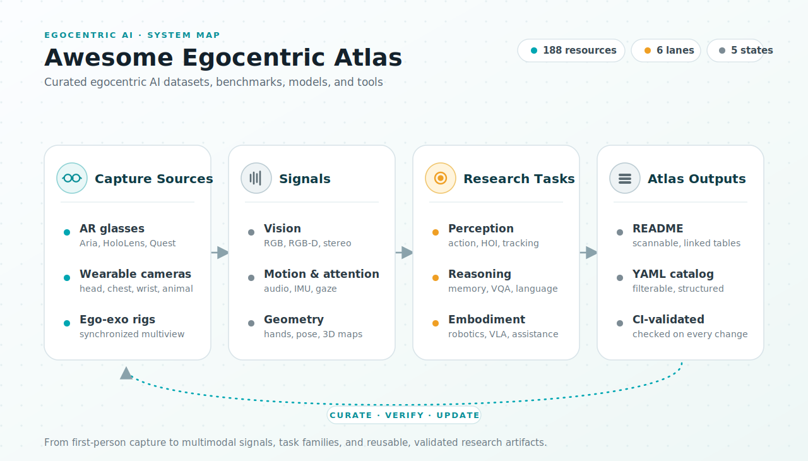
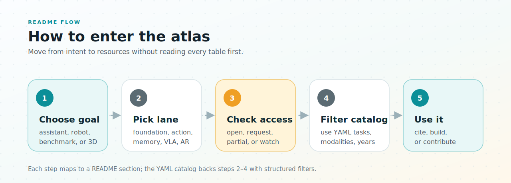
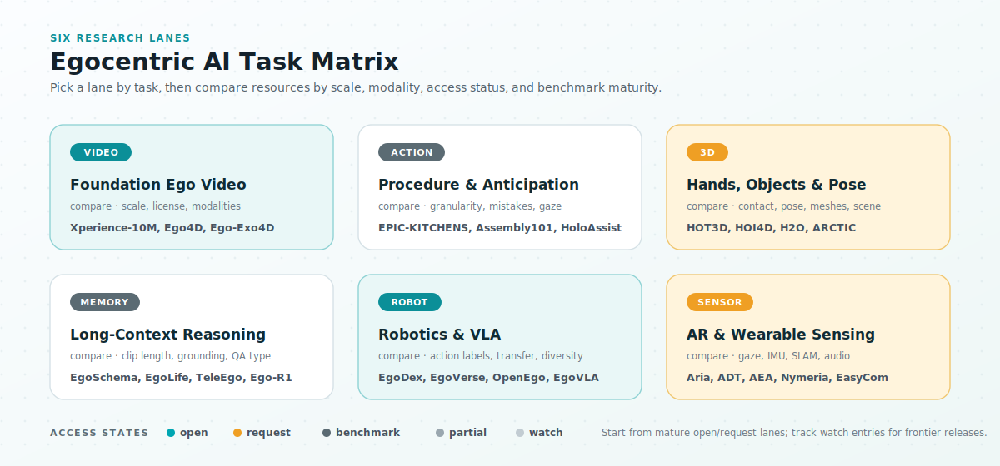

<p align="center">
  
</p>

<h1 align="center">Awesome Egocentric Atlas</h1>

<p align="center">
  <strong>Curated egocentric AI datasets, benchmarks, models, and tools.</strong>
</p>

<p align="center">
  <a href="https://github.com/sindresorhus/awesome"></a>
  <a href="https://github.com/ChaoYue0307/awesome-egocentric-atlas/actions/workflows/validate.yml"></a>
  <a href="data/resources.yml"></a>
  <a href="README.md#dataset-atlas"></a>
  <a href="README.md#models-tools-and-baselines"></a>
  <a href="LICENSE"></a>
  <a href="CONTRIBUTING.md"></a>
</p>

**Awesome Egocentric Atlas** is a curated, continuously updated map of the egocentric (first-person) AI landscape — datasets, benchmarks, models, and tools spanning computer vision, embodied AI and robotics, video-language learning, long-context memory, AR/VR, and hand-object interaction. Every entry is scored for public-access status, so you can tell what is usable today from what is still a paper promise.

**Updated:** 2026-06-14.  
**Scope:** human or animal first-person capture from head, glasses, headset, body, wrist, handheld, or synchronized ego-exo rigs. Adjacent robot/wrist-camera datasets are included when they are central to VLA or robot-learning research. Pure autonomous-driving dashcam datasets are out of the main table unless the resource explicitly targets wearable or embodied egocentric perception.

<p align="center">
  
</p>

## Contents

- [How to Use This Atlas](#how-to-use-this-atlas)
- [At a Glance](#at-a-glance)
- [Start Here](#start-here)
- [Landscape Snapshot](#landscape-snapshot)
- [Creator and Release Notes](#creator-and-release-notes)
- [Status Legend](#status-legend)
- [Fast Task Map](#fast-task-map)
- [Dataset Atlas](#dataset-atlas)
- [Benchmarks and Derived Annotations](#benchmarks-and-derived-annotations)
- [Models, Tools, and Baselines](#models-tools-and-baselines)
- [Surveys, Papers, and Context](#surveys-papers-and-context)
- [Workshops and Challenges](#workshops-and-challenges)
- [Watchlist](#watchlist)
- [Inclusion Rules](#inclusion-rules)
- [Contributing](#contributing)
- [Cite This Atlas](#cite-this-atlas)

## How to Use This Atlas

Use the first two tables to orient yourself, then jump into the detailed atlas section that matches your task. Each entry is deliberately short: name, scale/signal, best use, and public status. For filtering by task, modality, status, or year, use the catalog in [`data/resources.yml`](data/resources.yml).

<p align="center">
  
</p>

## At a Glance

| Signal | What it means for readers |
|---|---|
| 162 resources | 80 datasets, 44 benchmarks, 28 models, and 9 toolkits, plus a Project Aria collection hub — across vision, robotics, memory, and AR. |
| 6 research lanes | Foundation video, procedure/action, hands and 3D, memory/reasoning, robotics/VLA, and AR/wearable sensing. |
| 5 access states | `open`, `request`, `benchmark`, `partial`, and `watch` keep availability visible before you plan experiments. |
| Machine-checked catalog | [`data/resources.yml`](data/resources.yml) mirrors the README with type, year, status, URL, tasks, and provenance — and CI validates it on every change. |
| Reader-first tables | Each entry is short enough to scan, then links out to the official page, paper, code, or dataset portal. |

## Start Here

| Reader | Best first move | Then go deeper |
|---|---|---|
| New to egocentric vision | Read Ego4D, EPIC-KITCHENS-100, Ego-Exo4D, and EgoSchema first. | Add EgoClip/EgoVLP for video-language, VISOR for masks, and HOT3D/HOI4D for 3D hand-object work. |
| Building a benchmark table | Start from the `open` and `benchmark` entries, then inspect `request` licenses. | Use the YAML catalog to filter by task and modality. |
| Building an assistant or agent | Start with Ego4D, Xperience-10M, EgoLife, TeleEgo, EgoSchema, MyEgo, EgoIntrospect, EgoBench, and Ego2Web. | Track Ego-R1, X-LeBench, EgoMemReason, Minerva-Ego, EgoCoT-Bench, EgoBlind, EgoSound, and NoRA for reasoning diagnostics. |
| Building a robot/VLA system | Start with Xperience-10M, Open X-Embodiment, EgoDex, EgoVerse, Ego-Exo4D, HoloAssist, HOI4D, HOT3D, Assembly101, OpenEgo, EgoPAT3D, and WiYH. | Add EgoVLA, EgoEngine, EgoAERO, H2O, ARCTIC, HOMIE-toolkit, Xperience task baselines, and EgoHandTrajPred for policy/action supervision. |
| Studying hands, objects, and 3D | Start with HOT3D, HOI4D, H2O, ARCTIC, FPHA, EgoHOS, EgoBody, GIMO, EgoHumans, and UnrealEgo. | Add EgoTracks/TREK-150 for tracking and EgoEMG/EgoEVHands for emerging sensors. |

## Landscape Snapshot

<p align="center">
  
</p>

| Lane | What to compare | Canonical anchors |
|---|---|---|
| Foundation video | scale, license, modalities, benchmark maturity | Xperience-10M, Ego4D, Ego-Exo4D, EPIC-KITCHENS-100, EgoClip |
| Procedure and action | action granularity, mistakes, anticipation, gaze | EPIC-KITCHENS, Assembly101, MECCANO, EgoProceL, HoloAssist |
| Hand-object and 3D | hands, objects, contact, pose, meshes, scene geometry | HOT3D, HOI4D, H2O, ARCTIC, FPHA, EgoHOS |
| Memory and reasoning | clip length, grounding, QA type, streaming constraints | EgoSchema, EgoLife, TeleEgo, MyEgo, X-LeBench, EgoMemReason, EgoSound, Ego-R1 |
| Robotics and VLA | action labels, hand trajectories, robot transfer, task diversity | Open X-Embodiment, EgoDex, EgoVerse, OpenEgo, EgoPAT3D, WiYH, EgoVLA |
| AR/wearable sensing | gaze, IMU, SLAM, audio, physiological signals | Project Aria, ADT, AEA, Nymeria, EgoIntrospect, EasyCom |

## Creator and Release Notes

| Resource | Created / stewarded by | Release channel and access note |
|---|---|---|
| [Xperience-10M](https://huggingface.co/datasets/ropedia-ai/xperience-10m) | Ropedia | Released under `ropedia-ai` on Hugging Face. Full dataset uses controlled non-commercial access; the [sample](https://huggingface.co/datasets/ropedia-ai/xperience-10m-sample) is open, [HOMIE-toolkit](https://github.com/Ropedia/HOMIE-toolkit) loads/visualizes annotations, and [Xperience task baselines](https://huggingface.co/cy0307/ropedia-xperience-10m-task-baselines) provide a public evaluation artifact. |
| [Open X-Embodiment / RT-X](https://robotics-transformer-x.github.io/) | Open X-Embodiment Collaboration | Official project, paper, code, and data links are maintained by the collaboration. The [jxu124/OpenX-Embodiment](https://huggingface.co/datasets/jxu124/OpenX-Embodiment) Hugging Face dataset is an unofficial mirror that makes the 55-in-1 dataset easier to stream from Hugging Face. |
| [Ego4D](https://ego4d-data.org/) | Meta AI / Facebook AI with an international academic consortium | Official data portal with license-gated downloads and benchmark tasks. |
| [Ego-Exo4D](https://ego-exo4d-data.org/) | Meta and academic partners across the Ego-Exo4D consortium | Official data portal with application/download tooling for synchronized ego-exo data. |
| [EPIC-KITCHENS](https://epic-kitchens.github.io/) | University of Bristol-centered EPIC-KITCHENS team | Official challenge/dataset portal with public annotations and benchmark splits. |
| [Project Aria datasets](https://www.projectaria.com/datasets/) | Meta / Project Aria | Official Project Aria dataset portal and tooling for AR-glasses sensor data. |

## Status Legend

| Status | Meaning |
|---|---|
| `open` | Public download, public annotations, public code, or application-based access is clearly documented. |
| `request` | Public project exists, but dataset access requires license, form, approval, or institutional agreement. |
| `benchmark` | Mainly a benchmark, challenge, labels, or evaluation over existing videos. |
| `partial` | Some assets are public, but full raw data, license, or long-term availability is unclear. |
| `watch` | Recent or important resource whose release state still needs verification. |

## Fast Task Map

| Research goal | Strong starting points |
|---|---|
| General egocentric foundation data | [Xperience-10M](https://huggingface.co/datasets/ropedia-ai/xperience-10m), [Ego4D](https://ego4d-data.org/), [Ego-Exo4D](https://ego-exo4d-data.org/), [EPIC-KITCHENS-100](https://epic-kitchens.github.io/), [EgoClip](https://github.com/showlab/EgoVLP) |
| Ego-exo and skill learning | [Ego-Exo4D](https://ego-exo4d-data.org/), [EgoExoLearn](https://github.com/OpenGVLab/EgoExoLearn), [Assembly101](https://assembly-101.github.io/), [Look and Tell](https://arxiv.org/abs/2510.22672) |
| Robot manipulation / VLA | [Open X-Embodiment](https://robotics-transformer-x.github.io/), [EgoDex](https://arxiv.org/abs/2505.11709), [EgoVerse](https://egoverse.ai/), [OpenEgo](https://arxiv.org/abs/2509.05513), [EgoVLA](https://rchalyang.github.io/EgoVLA/), [EgoEngine](https://egoengine.github.io/) |
| Long-context QA and memory | [EgoSchema](http://egoschema.github.io/), [EgoLife](https://arxiv.org/abs/2503.03803), [EgoMemReason](https://arxiv.org/abs/2605.09874), [Ego-EXTRA](https://fpv-iplab.github.io/Ego-EXTRA/), [Minerva-Ego](https://github.com/google-deepmind/neptune), [EgoBench](https://arxiv.org/abs/2605.27820) |
| Hand-object and 3D HOI | [HOT3D](https://facebookresearch.github.io/hot3d/), [HOI4D](https://hoi4d.github.io/), [EgoHOS](https://github.com/owenzlz/EgoHOS), [FPHA](https://guiggh.github.io/publications/first-person-hands/), [EgoEMG](https://arxiv.org/abs/2605.05712) |
| Audio, speech, and social interaction | [Ego4D AV tasks](https://ego4d-data.org/), [EasyCom](https://arxiv.org/abs/2107.04174), [EgoCom / audio-visual correspondence](http://vision.cs.utexas.edu/projects/ego_av_corr/), [AV-CONV](https://vjwq.github.io/AV-CONV/) |
| AR glasses and scene understanding | [Project Aria Datasets](https://www.projectaria.com/datasets/), [Aria Digital Twin](https://www.projectaria.com/datasets/adt/), [AEA](https://www.projectaria.com/datasets/aea/), [Nymeria](https://www.projectaria.com/datasets/nymeria/), [DTC](https://www.projectaria.com/datasets/dtc/) |

## Dataset Atlas

### Foundational and Large-Scale Ego Video

Broad, large-scale first-person corpora that most egocentric pipelines pretrain or benchmark on.

| Resource | Scale / signal | Best for | Status |
|---|---|---|---|
| [Xperience-10M](https://huggingface.co/datasets/ropedia-ai/xperience-10m) | Ropedia release on Hugging Face; 10M experiences, 10K hours, six video streams, audio, stereo depth, camera pose, hand/body mocap, IMU, hierarchical language, ~1 PB total | Embodied AI, world models, robot learning from human experience, sensor fusion, 3D/4D understanding | request |
| [Xperience-10M Sample](https://huggingface.co/datasets/ropedia-ai/xperience-10m-sample) | Public sample episode for Xperience-10M with six rows on Hugging Face and `cc-by-nc-4.0` terms | Loader testing, demos, task-suite prototyping, annotation inspection | open |
| [Ego4D](https://ego4d-data.org/) | 3,670+ hours from 900+ camera wearers, multiple countries, video/audio/gaze/stereo/3D/narrations depending on subset | Long-form ego video, episodic memory, social, hand-object, forecasting, audio-visual tasks | request |
| [Ego-Exo4D](https://ego-exo4d-data.org/) | 1,286 hours, 740 participants, synchronized first- and third-person views, audio, gaze, IMU, 3D point clouds, language commentary | Skilled activity, ego-exo transfer, cross-view translation, pose, proficiency, robotics | request |
| [EPIC-KITCHENS-100](https://epic-kitchens.github.io/) | 100 hours, 20M frames, 90K actions, 45 kitchens, narrations and dense action labels | Kitchen action recognition, anticipation, action detection, retrieval | open |
| [HD-EPIC](https://arxiv.org/abs/2502.04144) | 41 hours, 9 kitchens, dense fine-grained labels, 3D fixture annotations, audio events, VQA | Detailed kitchen understanding, VQA, 3D-aware ego reasoning, audio-event recognition | open |
| [HoloAssist](https://holoassist.github.io/) | 166 hours, 350 instructor-performer pairs, 7 synchronized streams from mixed-reality headsets | Interactive assistance, mistake detection, intervention prediction, procedural collaboration | open |
| [Assembly101](https://assembly-101.github.io/) | 4,321 videos, 8 static plus 4 egocentric views, 100K coarse and 1M fine action segments, 18M 3D hand poses | Procedural action, anticipation, mistake detection, cross-view transfer | open |
| [Ego-1K](https://huggingface.co/datasets/facebook/ego-1k) | Nearly 1,000 synchronized multiview egocentric videos from a custom 12-camera plus VR-headset rig | Dynamic 3D/4D scene understanding and novel view synthesis from ego rigs | open |
| [EgoObjects](https://github.com/facebookresearch/EgoObjects) | Pilot release with 9K+ videos, 250 participants, 50+ countries, 650K annotations, 368 categories | Category and instance-level egocentric object understanding, continual object detection | open |
| [EgoCom / Ego audio-visual correspondence](http://vision.cs.utexas.edu/projects/ego_av_corr/) | Egocentric video with spatial audio for conversation and audio-visual correspondence tasks | Active speaker detection, spatial audio denoising, conversational graph reasoning | open |
| [EasyCom](https://arxiv.org/abs/2107.04174) | AR glasses egocentric multi-channel audio and wide-FOV RGB for noisy conversations | Speech enhancement, source localization, conversation assistance | open |
| [EgoBlind](https://arxiv.org/abs/2503.08221) | 1,392 first-person videos from blind and visually impaired users, 5,311 questions posed or verified by blind users | Assistive egocentric VideoQA for blind users | watch |
| [Look and Tell](https://arxiv.org/abs/2510.22672) | 25 participants, Project Aria plus stationary cameras, gaze/speech/video, 3D reconstructions | Referential communication across ego and exo viewpoints | watch |
| [EgoVid-5M](https://egovid.github.io/) | 5M curated egocentric clips at 1080p with fine-grained kinematic and high-level text action annotations (NeurIPS 2025) | Egocentric video generation and action-conditioned world models | open |

### Robotics, Manipulation, and VLA

Egocentric human-manipulation and wrist-camera data aimed at vision-language-action models and human-to-robot transfer.

| Resource | Scale / signal | Best for | Status |
|---|---|---|---|
| [EgoDex](https://arxiv.org/abs/2505.11709) | 829 hours of Apple Vision Pro egocentric video, 194 tabletop tasks, 3D hand/finger tracking | Dexterous manipulation, imitation learning, human-to-robot hand trajectory prediction | watch |
| [EgoVerse](https://egoverse.ai/) | 1,362 hours, 80K episodes, 1,965 tasks, 240 scenes, 2,087 demonstrators | Human demonstration scaling for robot learning and VLA | watch |
| [OpenEgo](https://arxiv.org/abs/2509.05513) | 1,107 hours unified across six public egocentric datasets, 290 manipulation tasks, hand-pose/action primitives | Standardized dexterous manipulation pretraining and evaluation | watch |
| [Open X-Embodiment / RT-X](https://robotics-transformer-x.github.io/) | 1M+ real robot trajectories, 22 robot embodiments, 60 pooled robot datasets, standardized RLDS format; [unofficial Hugging Face mirror](https://huggingface.co/datasets/jxu124/OpenX-Embodiment) is available | Robot-camera and wrist-camera VLA pretraining, cross-embodiment robot policy learning, RT-X baselines | open |
| [EgoLive](https://arxiv.org/abs/2604.23570) | Large-scale real-world task-oriented egocentric routines for robot manipulation | Home service, retail, and real-world work-task manipulation | watch |
| [World in Your Hands / WiYH](https://arxiv.org/abs/2512.24310) | Reported 1,000-hour egocentric manipulation ecosystem with multiview/depth/hand/wrist signals | VLA, manipulation representation learning | watch |
| [EgoPAT3D / EgoPAT3Dv2](https://arxiv.org/abs/2403.05046) | 1M+ RGB-D/IMU frames in the original task; v2 expands egocentric 3D action-target prediction | Human-robot interaction, 3D target anticipation, manipulation safety | open |
| [EgoVLA](https://rchalyang.github.io/EgoVLA/) | VLA training from egocentric human videos plus robot fine-tuning | Human-video-to-robot policy transfer | watch |
| [EgoEngine](https://egoengine.github.io/) | Framework converting egocentric human manipulation video into robot observation/action data | Human-to-robot data generation, dexterous imitation | watch |
| [EgoAERO](https://arxiv.org/abs/2606.08057) | Asset-free conversion from a single egocentric RGB-D demonstration; introduces EgoDex-R in the paper | Single-demo dexterous robot learning | watch |
| [HRDexDB](https://arxiv.org/abs/2604.14944) | 1.4K human/robot grasping trials, tactile, multiview video, egocentric video streams | Cross-domain dexterous grasp learning | watch |
| [InterVLA](https://arxiv.org/abs/2508.04681) | 11.4 hours and 1.2M frames with 2 ego and 5 exo views, human/object motions, and verbal commands | Vision-language-action and motion estimation | watch |
| [AoE: Always-on Egocentric](https://arxiv.org/abs/2602.23893) | Always-on egocentric human-video collection pipeline and corpus for embodied AI | Scaling human-video data for robot learning | watch |
| [Seeing Across Views](https://arxiv.org/abs/2510.19400) | 1.7K curated QA items testing whether VLMs fuse multiple camera views for manipulation (ICLR 2026) | Multi-view manipulation reasoning for VLMs | watch |

### Hands, Objects, Pose, Tracking, and 3D

Fine-grained hand, object, contact, and 3D-pose datasets, including emerging event-camera and EMG sensing.

| Resource | Scale / signal | Best for | Status |
|---|---|---|---|
| [HOT3D](https://facebookresearch.github.io/hot3d/) | 833+ minutes, 3.7M+ images, Aria and Quest 3, gaze, point clouds, 3D hand/object/camera poses | 3D hand-object tracking for AR/VR manipulation | open |
| [HOI4D](https://hoi4d.github.io/) | 2.4M RGB-D egocentric frames, 4,000+ sequences, 800 objects, 16 categories, 610 rooms | 4D human-object interaction, segmentation, object pose tracking, action segmentation | open |
| [H2O: Two Hands and Objects](https://arxiv.org/abs/2104.11181) | Synchronized multi-view RGB-D, two-hand 3D pose, 6D object pose, object meshes, camera poses | First-person two-hand interaction recognition and pose-aware HOI | open |
| [ARCTIC](https://arctic.is.tue.mpg.de/) | 2.1M frames with bimanual hand/object meshes, articulated objects, and contact | Dexterous bimanual manipulation, contact, reconstruction | request |
| [EgoHands](http://vision.soic.indiana.edu/projects/egohands/) | 48 Google Glass videos, 4,800 annotated hand images | Hand detection and segmentation | open |
| [FPHA / First-Person Hand Action](https://guiggh.github.io/publications/first-person-hands/) | 100K+ RGB-D frames, 45 action classes, 26 objects, 3D hand/object poses | 3D hand pose and first-person hand action recognition | open |
| [EgoHOS](https://github.com/owenzlz/EgoHOS) | 11,243 egocentric images with detailed hand/object/contact segmentation | Hand-object segmentation and contact-aware foreground modeling | open |
| [Ego2Hands](https://arxiv.org/abs/2011.07252) | Large-scale composited RGB egocentric two-hand segmentation/detection | Robust unconstrained hand segmentation | open |
| [Ego2HandsPose](https://arxiv.org/abs/2206.04927) | Extension of Ego2Hands with 3D global hand pose annotations | Two-hand RGB 3D pose in global coordinates | open |
| [EgoBody](https://sanweiliti.github.io/egobody/egobody.html) | HoloLens2 egocentric RGB/depth/eye/head/hand data with 3D body pose and shape | Egocentric human pose, shape, motion, social interaction | open |
| [GIMO](https://github.com/y-zheng18/GIMO) | Ego-centric views, gaze, scene scans, and high-quality body pose sequences | Gaze-informed human motion prediction in scene context | open |
| [EgoHumans](https://arxiv.org/abs/2305.16487) | 125K+ egocentric images for in-the-wild multi-human tracking, 2D/3D pose, and mesh recovery | Egocentric multi-human perception and tracking | partial |
| [UnrealEgo](https://4dqv.mpi-inf.mpg.de/UnrealEgo/) | Synthetic stereo eyeglass egocentric dataset with 3D human pose | Robust egocentric 3D human motion capture | open |
| [UnrealEgo2 / UnrealEgo-RW](https://arxiv.org/abs/2401.00889) | Expanded stereo egocentric pose datasets from synthetic and real-world capture | Stereo egocentric human pose estimation | watch |
| [xR-EgoPose](https://github.com/facebookresearch/xR-EgoPose) | Synthetic egocentric body pose data for XR headset viewpoints | 3D human pose from head-mounted cameras | open |
| [EgoGTA / EgoPW-Scene](https://arxiv.org/abs/2212.11684) | Synthetic EgoGTA plus EgoPW-based in-the-wild scene-aware pose data | Scene-aware egocentric 3D human pose estimation | partial |
| [EgoTracks](https://arxiv.org/abs/2301.03213) | Long-term egocentric visual object tracking annotations from Ego4D | Tracking, re-detection, embodied object persistence | open |
| [TREK-150](https://machinelearning.uniud.it/datasets/trek150/) | 150 egocentric tracking sequences derived from EPIC-KITCHENS | Single-object tracking in egocentric video | open |
| [TouchMoment](https://arxiv.org/abs/2604.12343) | 4,021 egocentric videos, 8,456 annotated hand-object contact moments | Precise contact moment detection | watch |
| [EgoFun3D](https://arxiv.org/abs/2604.11038) | 271 egocentric videos with 3D geometry, part segmentation, articulation and function-template annotations | Interactive 3D object modeling from ego video | watch |
| [EgoEMG](https://arxiv.org/abs/2605.05712) | 41 participants, bilateral EMG, IMU, RGB, external RGB-D, mocap hand labels | EMG plus egocentric vision hand pose estimation | watch |
| [EgoEVHands](https://github.com/ZJUWang01/EgoEV-HandPose) | Stereo event-camera egocentric hand dataset with 5,419 sequences and 3D/2D keypoints | Event-based bimanual hand pose and gesture recognition | watch |
| [EventEgoHands](https://arxiv.org/abs/2505.19169) | Event-based egocentric 3D hand mesh reconstruction benchmark over N-HOT3D | Low-light and motion-blur hand reconstruction | watch |
| [A multimodal RGB/events FPV hand dataset](https://arxiv.org/abs/2606.10790) | Synthetic event-based first-person hand detection from EgoHands plus v2e | Event/RGB hand detection benchmarking | watch |
| [EgoGesture](https://ieeexplore.ieee.org/document/8299578/) | 24K+ gesture samples, 3M RGB-D frames, 50 subjects, 83 static and dynamic gestures across six scenes | First-person gesture recognition for wearable interaction | open |
| [Egocentric HOI Detection](https://arxiv.org/abs/2506.14189) | New benchmark and method for detecting hand-object interactions in egocentric video | Egocentric hand-object interaction detection | open |
| [EgoBrain](https://arxiv.org/abs/2506.01353) | Synchronized EEG and egocentric video for human action understanding | Brain-signal plus first-person action understanding | watch |

### Daily Life, Memory, Assistance, and QA

Long-horizon daily-life capture and the question-answering benchmarks that probe memory, reasoning, and assistance.

| Resource | Scale / signal | Best for | Status |
|---|---|---|---|
| [EgoLife](https://arxiv.org/abs/2503.03803) | 300 hours from six participants over one week with Meta Aria, third-person references, and EgoLifeQA | Long-term daily-life memory, personalized assistants, ultra-long QA | partial |
| [Ego-EXTRA](https://fpv-iplab.github.io/Ego-EXTRA/) | 50 hours of expert-trainee procedural assistance dialogue, 15K+ VQA pairs | Egocentric video-language assistants and expert feedback | open |
| [EgoSchema](http://egoschema.github.io/) | 5K+ curated multiple-choice QA pairs over 250+ hours from Ego4D clips | Very long-form video-language understanding | benchmark |
| [X-LeBench](https://arxiv.org/abs/2501.06835) | 432 simulated life logs over Ego4D-like footage, spanning 23 minutes to 16.4 hours | Extremely long egocentric video understanding | watch |
| [TeleEgo](https://arxiv.org/abs/2510.23981) | Streaming omni-modal benchmark with 3,291 QA items across memory, understanding, and cross-memory reasoning | Real-time egocentric AI assistant evaluation | watch |
| [EgoMemReason](https://arxiv.org/abs/2605.09874) | 500 questions over week-long egocentric video with entity, event, and behavior memory types | Memory-driven reasoning across sparse evidence over hours or days | watch |
| [EgoBench](https://arxiv.org/abs/2605.27820) | 1,045 egocentric-video-grounded interactive tasks with tools and simulated users | Tool-using multimodal agents with dynamic interaction | watch |
| [EgoIntrospect](https://ego-introspect.github.io/) | 180 hours from 60 subjects with synchronized video, audio, gaze, motion, physiological signals | Internal-state reasoning, affect, intent, cognitive memory for wearable assistants | watch |
| [Minerva-Ego](https://github.com/google-deepmind/neptune) | Dense spatiotemporal reasoning traces and masks over egocentric/embodied video sources | Inspecting where/when models reason in egocentric video | open |
| [MA-EgoQA](https://ma-egoqa.github.io/) | 1.7K questions over multiple long-horizon egocentric streams | Multi-agent egocentric memory reasoning | open |
| [EgoExoMem](https://arxiv.org/abs/2605.18734) | 2.6K MCQs across synchronized ego-exo videos | Cross-view memory reasoning | watch |
| [EgoSelf](https://abie-e.github.io/egoself_project/) | Personalized egocentric assistant framework with graph memory | Personalization from long-term egocentric interaction memory | watch |
| [EgoGraph](https://arxiv.org/abs/2602.23709) | Dynamic temporal knowledge graph framework evaluated on EgoLifeQA and EgoR1-bench | Training-free ultra-long egocentric video memory | watch |
| [MyEgo](https://github.com/Ryougetsu3606/MyEgo) | 541 long videos and 5K personalized questions about the camera wearer, belongings, activities, and past | Personalized ego-grounding and long-range memory QA | open |
| [EgoCross](https://github.com/MyUniverse0726/EgoCross) | About 1,000 QA pairs over surgery, industry, extreme sports, and animal-perspective clips | Cross-domain egocentric QA generalization | watch |
| [EgoToM](https://arxiv.org/abs/2503.22152) | Theory-of-mind QA over Ego4D-style egocentric videos | Goals, beliefs, and next-action reasoning for camera wearers | watch |
| [EgoSound](https://arxiv.org/abs/2602.14122) | 7,315 validated QA pairs across 900 Ego4D/EgoBlind videos | Sound perception, spatial localization, causal audio-visual reasoning | watch |
| [EgoEsportsQA](https://arxiv.org/abs/2604.12320) | 1,745 QA pairs from professional first-person shooter matches across three games | High-speed first-person perception and tactical reasoning in virtual environments | watch |
| [EASG-Bench](https://github.com/fpv-iplab/EASG-bench) | Egocentric action-scene-graph-based video QA benchmark | Scene graph, temporal order, and relation-aware QA | open |
| [Causal-Plan-1M](https://arxiv.org/abs/2606.01810) | Reported million-scale corpus of explicit causal reasoning traces over egocentric videos | Causal and planning-oriented ego reasoning | watch |
| [AssistQ](https://showlab.github.io/assistq/) | 531 question-answer samples from 100 newly filmed instructional videos | Assistance-oriented video QA and affordance-centric task completion | open |
| [EgoTaskQA](https://arxiv.org/abs/2210.03929) | Diagnostic QA benchmark for task dependencies, effects, intents, beliefs, and counterfactuals in ego video | Task-step reasoning and procedural QA | benchmark |
| [HowToDIV](https://arxiv.org/abs/2508.11192) | 507 conversations, 6,636 QA pairs, 24 hours of egocentric instructional task-assistance video clips | Instructional dialogue and procedural video reasoning | watch |
| [EgoThink](https://arxiv.org/abs/2311.15596) | First-person VQA benchmark covering six capability groups and twelve dimensions | First-person perspective reasoning for VLMs | benchmark |
| [VidEgoThink](https://arxiv.org/abs/2410.11623) | Ego4D-based benchmark for video QA, hierarchy planning, visual grounding, and reward modeling | Embodied egocentric video understanding | benchmark |
| [EgoCoT-Bench](https://dstardust.github.io/EgoCoT/) | 3,172 verifiable QA pairs over 351 videos with operation-centric rationale annotations | Grounded chain-of-thought and evidence consistency | open |
| [NoRA](https://arxiv.org/abs/2606.04806) | 1,420 first-person video clips for normative action reasoning with fact-reason-action support graphs | Grounded reasonableness and safety-oriented action generation | watch |
| [Ego2Web](https://arxiv.org/abs/2603.22529) | Egocentric videos paired with web tasks requiring physical-scene understanding and online execution | Web agents grounded in first-person physical context | watch |
| [Pause and Think](https://arxiv.org/abs/2606.00616) | Reasoning-centric training data and benchmark for video-grounded assistive action suggestions | Scene-grounded assistance, planning, and temporal consistency | watch |
| [Ego-R1](https://arxiv.org/abs/2506.13654) | Ego-CoTT-25K, Ego-QA-4.4K, and Ego-R1 Bench for tool-augmented ultra-long egocentric QA | Chain-of-tool-thought reasoning over days/week-long videos | watch |
| [EgoTrigger / HME-QA](https://arxiv.org/abs/2508.01915) | Audio-driven smart-glasses capture strategy plus 340 first-person HME-QA pairs from full-length Ego4D videos | Energy-efficient memory assistance and audio-triggered capture | watch |
| [EgoStream](https://arxiv.org/abs/2605.31557) | 2,250 questions across seven memory dimensions with Answer Validity Windows, expanded to 8,528 recall-conditioned evaluations over streams up to 45.3 hours | Diagnosing streaming episodic memory | watch |
| [EgoMemory](https://openreview.net/forum?id=T0em4hJCQb) | 165,795 user-specific object annotations over 245 videos from 45 participants | Memory-augmented personalized retrieval | watch |
| [EgoTextVQA](https://openaccess.thecvf.com/content/CVPR2025/papers/Zhou_EgoTextVQA_Towards_Egocentric_Scene-Text_Aware_Video_Question_Answering_CVPR_2025_paper.pdf) | Egocentric scene-text-aware video QA across housekeeping and driving scenes (CVPR 2025) | Reading and reasoning over first-person scene text | open |
| [Gesture-Based Egocentric Video QA](https://arxiv.org/abs/2603.12533) | Egocentric video QA grounded in the camera wearer's pointing and deictic gestures | Gesture-grounded referential QA | watch |
| [ExAct](https://arxiv.org/abs/2506.06277) | Video-language benchmark for expert action analysis and feedback over skilled activity | Expert feedback and skill assessment | open |
| [EgoVQA](https://openaccess.thecvf.com/content_ICCVW_2019/html/EPIC/Fan_EgoVQA_-_An_Egocentric_Video_Question_Answering_Benchmark_Dataset_ICCVW_2019_paper.html) | 600+ QA pairs over egocentric videos; an early first-person VideoQA benchmark | Classic egocentric VideoQA | open |

### Action, Procedure, Lifelogging, and Classic FPV

Procedural and activity datasets, from modern industrial assembly to the classic first-person-vision benchmarks that started the field.

| Resource | Scale / signal | Best for | Status |
|---|---|---|---|
| [GTEA](https://cbs.ic.gatech.edu/fpv/) | Early first-person cooking/activity dataset | Classic ego action recognition and object interaction | open |
| [GTEA Gaze / EGTEA Gaze+](https://cbs.ic.gatech.edu/fpv/) | Meal-prep egocentric videos with gaze and action annotations | Gaze-aware action recognition and hand-object attention | open |
| [ADL Dataset](https://www.csc.kth.se/cvap/actions/) | Unscripted daily activity recordings with activity/object/hand annotations in classic literature | Daily living action recognition and object interaction | partial |
| [Wrist-mounted ADL](https://arxiv.org/abs/1511.06783) | Synchronized head and wrist wearable-camera daily activities | Comparing head- versus wrist-mounted first-person views | open |
| [Charades-Ego](https://prior.allenai.org/projects/charades) | 68.8 hours paired first-person and third-person videos, 68K+ activity instances | Ego-exo domain transfer, action recognition, localization, captioning | open |
| [MECCANO](https://iplab.dmi.unict.it/MECCANO/) | Industrial-like motorbike model assembly with RGB/depth/gaze variants | EHOI, active object detection, anticipation, industrial procedures | open |
| [EGO-CH](https://arxiv.org/abs/2002.00899) | 27+ hours, 70 subjects, two cultural sites, 26 environments, 200+ points of interest | Cultural heritage visitor behavior, localization, retrieval, preference prediction | partial |
| [EgoProceL](https://sid2697.github.io/egoprocel/) | 62 hours, 130 subjects, 16 procedural tasks | Key-step localization and procedure learning from ego videos | open |
| [EgoExoLearn](https://github.com/OpenGVLab/EgoExoLearn) | 120 hours of egocentric plus demonstration videos with gaze and annotations | Bridging asynchronous ego and exo procedural activity | open |
| EPIC-Tent | Tent assembly with dual head-mounted cameras, action/error/gaze/self-rating annotations | Error-aware procedural learning | partial |
| [KrishnaCam / OAK](https://oakdata.github.io/) | Long-running Google Glass daily-life stream; OAK adds 17.5 hours of object annotations | Continual object detection, summarization, personal visual memory | partial |
| [Visual Experience Dataset / VEDB](http://tamaraberg.com/visualexperience/) | 240+ hours egocentric video with gaze/head tracking in classic literature | Lifelogging, attention modeling, visual experience statistics | partial |
| [UT Ego](http://vision.cs.utexas.edu/projects/egocentric/) | Long daily egocentric videos in classic summarization work | Temporal segmentation and summarization | partial |
| [HUJI EgoSeg](https://www.vision.huji.ac.il/egoseg/) | Long egocentric videos for temporal segmentation | Egocentric event segmentation | partial |
| VINST | Commute-oriented egocentric video in legacy literature | Daily commute summarization and segmentation | partial |
| [JPL First-Person Interaction](https://ieeexplore.ieee.org/document/6909626) | First-person videos of people interacting with a humanoid observer | Human interaction recognition from first person | partial |
| [DogCentric](https://robotics.ait.kyushu-u.ac.jp/dog-centric-activity-dataset/) | Dog-mounted first-person activity videos | Animal egocentric activity recognition | open |
| [EgoK360](https://egok360.github.io/) | First-person 360-degree activity videos | 360-degree egocentric activity recognition | partial |
| [FT-HID](https://github.com/ENDLICHERE/FT-HID) | 90K+ RGB-D first- and third-person human interaction samples from 109 subjects | FPV/TPV aligned human interaction analysis | open |
| [LSC-ADL](https://arxiv.org/abs/2504.02060) | ADL annotations over lifelogging data generated with clustering plus human review | Activity-aware lifelog retrieval | open |
| [Home Action Genome / HOMAGE](https://homeactiongenome.org/) | 27 participants, synchronized ego and third-person views, 12 sensor types, hierarchical activity/action labels | Compositional multi-view home activity understanding | open |
| [EgoExo-Fitness](https://github.com/iSEE-Laboratory/EgoExo-Fitness) | Synchronized ego and exo fitness videos with keypoint verification, execution comments, and quality scores (ECCV 2024) | Ego-exo full-body action quality and skill assessment | open |
| [WEAR](https://mariusbock.github.io/wear/) | 22 participants, 18 outdoor workouts, synchronized egocentric video and 3D acceleration across 11 locations (IMWUT 2024) | Vision-plus-inertial outdoor activity recognition | open |

### Project Aria, AR/VR, and 3D Scene Resources

AR-glasses and headset data with gaze, SLAM, and digital-twin annotations for scene-level perception.

| Resource | Scale / signal | Best for | Status |
|---|---|---|---|
| [Project Aria Datasets](https://www.projectaria.com/datasets/) | Official portal for Aria-based datasets and tooling | AR glasses, wearable sensing, scene reconstruction, gaze, SLAM | open |
| [Aria Digital Twin / ADT](https://www.projectaria.com/datasets/adt/) | 200 real-world activity sequences, raw Aria streams, 6DoF poses, object poses, depth, segmentation, synthetic renderings | Egocentric 3D machine perception and digital-twin evaluation | open |
| [Aria Everyday Activities / AEA](https://www.projectaria.com/datasets/aea/) | 143 daily activity sequences across five indoor locations with trajectories, point clouds, gaze, speech | Everyday AR perception, scene reconstruction, prompted segmentation | open |
| [Nymeria](https://www.projectaria.com/datasets/nymeria/) | 300 hours, 264 participants, 50 locations, Aria, motion, language, observer view | Egocentric motion, language grounding, body tracking, daily activity | open |
| [Digital Twin Catalog / DTC](https://www.projectaria.com/datasets/dtc/) | 2,000 scanned objects with DSLR and egocentric AR-glasses image sequences | Digital-twin object reconstruction and evaluation | open |
| [EgoTraj](https://github.com/yehiahmad/EgoTraj) | 75 Meta Quest Pro navigation sequences with RGB, head pose, gaze, scene labels | Egocentric human trajectory prediction and assistive navigation | open |
| [SEED4D](https://seed4d.github.io/) | Synthetic ego-exo dynamic 4D generator and driving dataset | Synthetic 3D/4D reconstruction research with ego-exo settings | open |

## Benchmarks and Derived Annotations

Evaluation suites and label sets built on top of the raw datasets above.

| Benchmark | Built on | Tasks | Status |
|---|---|---|---|
| [Ego4D Benchmarks](https://ego4d-data.org/) | Ego4D | Natural Language Query, Moment Query, episodic memory, state change, long-term anticipation, social/audio, hand-object | benchmark |
| [Ego-Exo4D Benchmarks](https://ego-exo4d-data.org/) | Ego-Exo4D | Fine-grained activity, proficiency, cross-view translation, 3D pose, object correspondence | benchmark |
| [EPIC-KITCHENS Challenges](https://epic-kitchens.github.io/) | EPIC-KITCHENS / EPIC-KITCHENS-100 | Recognition, detection, anticipation, retrieval, domain adaptation | benchmark |
| [HD-EPIC VQA Challenge](https://arxiv.org/abs/2502.04144) | HD-EPIC | Recipe, ingredient, nutrition, fine-grained action, 3D perception, object motion, gaze | benchmark |
| [VISOR](https://epic-kitchens.github.io/VISOR/) | EPIC-KITCHENS | Manual and dense masks, hand/object segmentation, active object relations | open |
| [EPIC-Sounds](https://epic-kitchens.github.io/epic-sounds/) | EPIC-KITCHENS | Audio event recognition in egocentric kitchen video | open |
| [EPIC-Fields](https://epic-kitchens.github.io/epic-fields/) | EPIC-KITCHENS | 3D fields and scene-level spatial reasoning over kitchen video | open |
| [TREK-150](https://machinelearning.uniud.it/datasets/trek150/) | EPIC-KITCHENS | Egocentric single-object tracking | open |
| [EgoClip / EgoMCQ](https://github.com/showlab/EgoVLP) | Ego4D | 3.8M clip-text pairs and MCQ development benchmark for egocentric VLP | open |
| [RefEgo](https://github.com/shuheikurita/RefEgo) | Ego4D | 12K+ clips / 41 hours for first-person referring-expression comprehension and referred-object tracking | open |
| [EgoSchema](http://egoschema.github.io/) | Ego4D | Very-long-form multiple-choice video QA | open |
| [EgoHOIBench / EgoNCE++](https://github.com/xuboshen/EgoNCEpp) | Multiple egocentric HOI sources | Open-vocabulary hand-object interaction understanding | open |
| [EASG-Bench](https://github.com/fpv-iplab/EASG-bench) | Egocentric action scene graphs | Relation and temporal QA | open |
| [Minerva-Ego](https://github.com/google-deepmind/neptune) | Egocentric/embodied video sources | Multi-step QA with spatiotemporal reasoning traces and masks | open |
| [MA-EgoQA](https://ma-egoqa.github.io/) | Multi-agent egocentric streams | Social, task coordination, theory-of-mind, temporal, environment QA | open |
| [Ropedia Xperience-10M Task Suite](https://huggingface.co/spaces/cy0307/ropedia-xperience-10m-task-suite) | Xperience-10M Sample | 12 embodied-AI task contracts, sample baselines, and evaluation protocol | open |
| [EgoBench](https://arxiv.org/abs/2605.27820) | Egocentric video tasks | Interactive multimodal tool-using agents | watch |
| [EgoCross](https://github.com/MyUniverse0726/EgoCross) | Cross-domain ego clips | Surgery, industry, extreme sports, animal-perspective QA | watch |
| [EgoExoMem](https://arxiv.org/abs/2605.18734) | Synchronized ego-exo videos | Cross-view memory QA | watch |
| [EgoMemReason](https://arxiv.org/abs/2605.09874) | Week-long egocentric video | Entity, event, and behavior memory reasoning | watch |
| [EgoEsportsQA](https://arxiv.org/abs/2604.12320) | First-person esports video | Fast virtual first-person perception and reasoning | watch |

## Models, Tools, and Baselines

Open models, baselines, and loaders you can build on directly.

### Video-Language and Long-Video Models

| Resource | What it contributes | Link |
|---|---|---|
| EgoVLP / EgoNCE | EgoClip, EgoNCE objective, EgoMCQ, and transfer to Ego4D/EPIC/Charades-Ego tasks | [GitHub](https://github.com/showlab/EgoVLP) |
| EgoVLPv2 | Egocentric video-language pretraining with fusion in the backbone | [Project](https://shramanpramanick.github.io/EgoVLPv2/) |
| LaViLa | Learns video-language representations from Ego4D narrations and LLM-generated narrations | [Paper](https://arxiv.org/abs/2212.04501) |
| EgoNCE++ | Open-vocabulary HOI benchmark and asymmetric contrastive objective | [GitHub](https://github.com/xuboshen/EgoNCEpp) |
| EgoDTM | Depth- and text-aware egocentric VLP for 3D-aware representations | [GitHub](https://github.com/xuboshen/EgoDTM) |
| EgoVLM | GRPO-style policy optimization for egocentric video reasoning | [Paper](https://arxiv.org/abs/2506.03097) |
| EgoLife / EgoButler / EgoGPT / EgoRAG | Omni-modal egocentric assistant system with retrieval over long life recordings | [Paper](https://arxiv.org/abs/2503.03803) |
| EgoGraph | Training-free temporal knowledge graph for ultra-long egocentric video understanding | [Paper](https://arxiv.org/abs/2602.23709) |
| Ego-R1 | Chain-of-tool-thought framework and training data for ultra-long egocentric video QA | [Paper](https://arxiv.org/abs/2506.13654) |
| Ropedia Xperience-10M Task Baselines | Public Xperience-10M sample task definitions, baselines, metrics, and scale-up evaluation notes | [Hugging Face](https://huggingface.co/cy0307/ropedia-xperience-10m-task-baselines) |
| GroundVQA | Unified temporal grounding and open/closed QA for long egocentric videos | [GitHub](https://github.com/Becomebright/GroundVQA) |
| HiERO | Weakly supervised hierarchical activity-thread representations for EgoMCQ, EgoNLQ, and procedure learning | [Paper](https://arxiv.org/abs/2505.12911) |
| EgoAgent | Joint predictive agent model for perception, future-state prediction, and action in egocentric worlds | [Paper](https://arxiv.org/abs/2502.05857) |
| EgoEnv | Environment-aware representation learning from egocentric video | [Project](https://vision.cs.utexas.edu/projects/ego-env/) |
| EgoMAS | Shared-memory baseline for multi-agent egocentric video QA | [Project](https://ma-egoqa.github.io/) |
| MM-Ego | Egocentric multimodal LLM with Memory Pointer Prompting and a 7M-sample egocentric QA data engine (EgoMemoria benchmark) | [Paper](https://arxiv.org/abs/2410.07177) |

### Action, Tracking, Pose, and HOI Baselines

| Resource | What it contributes | Link |
|---|---|---|
| EPIC-KITCHENS action models | Public baseline models for EPIC-KITCHENS action recognition | [GitHub](https://github.com/epic-kitchens/action-models) |
| Ego-Exo representation transfer | Distillation from third-person video using ego-specific latent signals | [Paper](https://arxiv.org/abs/2104.07905) |
| EgoPoseFormer | Transformer baseline for stereo egocentric 3D human pose estimation | [GitHub](https://github.com/ChenhongyiYang/egoposeformer) |
| EgoSTARK | Adapted long-term tracker baseline for EgoTracks | [Paper](https://arxiv.org/abs/2301.03213) |
| EgoHOS model | Context-aware hand-object segmentation and augmentation pipeline | [GitHub](https://github.com/owenzlz/EgoHOS) |
| AV-CONV | Audio-visual conversational graph prediction from ego/exo conversation | [Project](https://vjwq.github.io/AV-CONV/) |
| StillFast | End-to-end short-term object interaction anticipation for Ego4D | [Project](https://iplab.dmi.unict.it/stillfast/) |
| CONE | Coarse-to-fine alignment framework for Ego4D Natural Language Queries | [Paper](https://arxiv.org/abs/2211.08776) |
| EgoHandTrajPred / USST | Egocentric 3D hand trajectory forecasting over H2O and EgoPAT3D-style settings | [Project](https://actionlab-cv.github.io/EgoHandTrajPred) |
| EgoAction | CVPR 2026 EPIC-KITCHENS action detection challenge pipeline | [Paper](https://arxiv.org/abs/2605.24496) |
| EgoAdapt | CVPR 2026 HD-EPIC VQA challenge inference-time adaptation pipeline | [Paper](https://arxiv.org/abs/2605.24500) |

### Practical Tooling

| Tool | Use |
|---|---|
| [Ego4D CLI and docs](https://ego4d-data.org/) | Downloading and working with Ego4D data after license approval. |
| [Ego-Exo4D CLI and docs](https://ego-exo4d-data.org/) | Downloading synchronized ego-exo data and annotations. |
| [Project Aria Tools](https://github.com/facebookresearch/projectaria_tools) | Reading Aria VRS, calibration, MPS, trajectory, gaze, and dataset artifacts. |
| [VISOR API](https://github.com/epic-kitchens/VISOR) | Loading dense EPIC-KITCHENS hand/object masks and relations. |
| [EgoObjects API](https://github.com/facebookresearch/EgoObjects) | Working with category and instance-level egocentric object labels. |
| [HOT3D tooling](https://facebookresearch.github.io/hot3d/) | Loading HOT3D hand/object/camera pose annotations and models. |
| [HOI4D tooling](https://hoi4d.github.io/) | Loading RGB-D frames, point clouds, object meshes, and pose/segmentation annotations. |
| [HOMIE-toolkit](https://github.com/Ropedia/HOMIE-toolkit) | Loading and visualizing Xperience-10M HDF5 annotations, calibration, SLAM, hand/body mocap, depth, IMU, and point clouds. |

## Surveys, Papers, and Context

Foundational papers and recent surveys for background and citation.

| Resource | Why it matters |
|---|---|
| [Ego4D: Around the World in 3,000 Hours of Egocentric Video](https://arxiv.org/abs/2110.07058) | Defines the modern large-scale egocentric benchmark suite. |
| [Ego-Exo4D: Understanding Skilled Human Activity from First- and Third-Person Perspectives](https://arxiv.org/abs/2311.18259) | Defines the major synchronized ego-exo activity resource. |
| [Scaling Egocentric Vision: The EPIC-KITCHENS Dataset](https://arxiv.org/abs/1804.02748) and [EPIC-KITCHENS-100](https://arxiv.org/abs/2006.13256) | Core kitchen/action-recognition benchmark lineage. |
| [Egocentric Video-Language Pretraining](https://arxiv.org/abs/2206.01670) | Introduces EgoClip and EgoNCE, a central egocentric VLP recipe. |
| [EgoSchema](https://arxiv.org/abs/2308.09126) | A widely used diagnostic benchmark for very long-form video-language understanding. |
| [HoloAssist](https://arxiv.org/abs/2309.17024) | Important for human-AI assistance and instructor-performer interaction. |
| [Nymeria](https://arxiv.org/abs/2406.09905) | Major egocentric multimodal motion-language dataset from Project Aria. |
| [HOT3D](https://arxiv.org/abs/2406.09598) | Major 3D hand-object tracking dataset for AR/VR. |
| [OpenEgo](https://arxiv.org/abs/2509.05513), [EgoDex](https://arxiv.org/abs/2505.11709), [EgoVerse](https://arxiv.org/abs/2604.07607) | The current frontier for scaling egocentric manipulation data toward robot learning. |
| [Challenges and Trends in Egocentric Vision: A Survey](https://arxiv.org/abs/2503.15275) | Recent comprehensive survey of egocentric tasks, datasets, and open problems. |
| [Bridging Perspectives: Cross-view Collaborative Intelligence with Egocentric-Exocentric Vision](https://arxiv.org/abs/2506.06253) | Survey of ego-exo collaboration and paired-capture research. |

## Workshops and Challenges

Recurring venues and challenge hubs where new egocentric tasks and leaderboards appear.

| Event / hub | Focus |
|---|---|
| [Ego4D Challenges](https://ego4d-data.org/) | Episodic memory, forecasting, hand-object, social/audio, and other Ego4D tasks. |
| [Ego-Exo4D Challenges](https://ego-exo4d-data.org/) | Cross-view, correspondence, pose, skill, and proficiency tasks. |
| [EPIC-KITCHENS Challenges](https://epic-kitchens.github.io/) | Action recognition, action detection, anticipation, retrieval, and domain adaptation. |
| [HOT3D Challenge](https://facebookresearch.github.io/hot3d/) | 3D hand-object tracking and AR/VR pose estimation. |
| [Project Aria](https://www.projectaria.com/) | Aria datasets, tools, and AR sensing ecosystem. |
| [Joint Egocentric Vision (EgoVis) Workshop](https://egovis.github.io/cvpr26/) | Cross-dataset egocentric vision workshop (CVPR) spanning Ego4D, Ego-Exo4D, EPIC-KITCHENS, HoloAssist, and more. |
| [CVPR / ICCV / ECCV egocentric and embodied AI workshops](https://cvpr.thecvf.com/) | Search annually for "egocentric", "embodied", "ego-exo", "wearable", and "first-person". |

## Watchlist

These entries are promising but should be rechecked before treating them as stable public datasets in a paper or benchmark.

| Resource | Why to track | Current note |
|---|---|---|
| EgoLive | Large real-world egocentric manipulation data for robot learning | Paper claims open-source annotated data; stable full download route needs verification. |
| WiYH | Large manipulation corpus with rich hand/wrist/depth signals | Release and license need verification. |
| OpenEgo | Unified manipulation platform over public ego datasets | Resources announced; verify full release state. |
| EgoVerse | Major 2026 robot-learning egocentric platform | Track dataset portal, tooling, and terms. |
| EgoDex | Large Apple Vision Pro manipulation data | Track official dataset/benchmark release path. |
| EgoIntrospect | Internal-state reasoning from multimodal wearable signals | Release promised; verify when full package is public. |
| EgoBench | Interactive egocentric benchmark for tool-using agents | Track code, environment, and evaluation protocol. |
| EgoAERO / EgoEngine | Conversion of egocentric videos into robot demonstrations | Track code and dataset artifacts. |
| EgoEMG / EgoEVHands / TouchMoment / EgoFun3D | 2026 hand/contact/event/3D frontier resources | Track GitHub/HF data release and license. |
| Causal-Plan-1M / HowToDIV / EgoThink-family / EgoCoT / NoRA / Ego2Web / Pause and Think | Reasoning, planning, safety, and agentic egocentric benchmarks | Confirm URLs, licenses, and raw-video dependencies. |

## Inclusion Rules

1. Prefer official project pages, GitHub repositories, Hugging Face datasets, arXiv pages, or university dataset pages.
2. Keep the public status conservative. If raw video is not clearly available, mark `partial` or `watch`.
3. Separate raw datasets from derived annotations and benchmarks.
4. Record modality, scale, task, license/access friction, and raw-video dependency when known.
5. Include adjacent robot datasets only when robot/wrist-camera observations are central to VLA, robot-learning, or human-to-robot transfer.
6. Exclude pure dashcam/autonomous-driving data unless the task is explicitly egocentric/wearable/embodied rather than vehicle-only.
7. Keep figures text-light. Exact resource names and labels should remain in Markdown/SVG so readers can inspect them directly.

## Contributing

Contributions are welcome through pull requests and issues. See [`CONTRIBUTING.md`](CONTRIBUTING.md) for the inclusion policy, status rules, and style.

The catalog is machine-checked. Before opening a pull request, run the validator:

```bash
ruby scripts/validate_catalog.rb
```

It verifies the catalog shape, statuses, kinds, README local links and assets, and that the resources badge and "Updated" date stay in sync with [`data/resources.yml`](data/resources.yml). The same check runs in CI on every push and pull request.

## Cite This Atlas

If this atlas helps your research or project, a citation or a link back is appreciated. Machine-readable metadata lives in [`CITATION.cff`](CITATION.cff).

```bibtex
@misc{yue_awesome_egocentric_atlas,
  author       = {Yue, Chao},
  title        = {Awesome Egocentric Atlas: Curated Egocentric AI Datasets, Benchmarks, Models, and Tools},
  year         = {2026},
  howpublished = {\url{https://github.com/ChaoYue0307/awesome-egocentric-atlas}}
}
```
