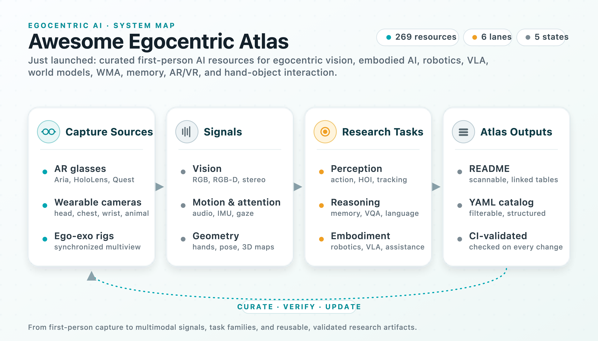
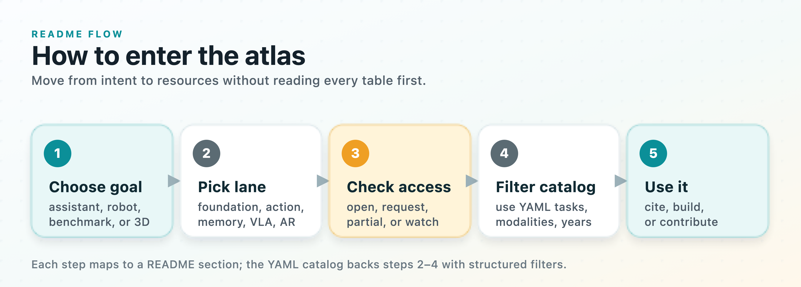
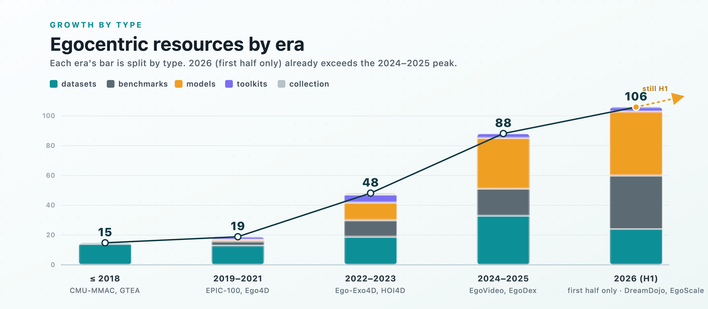
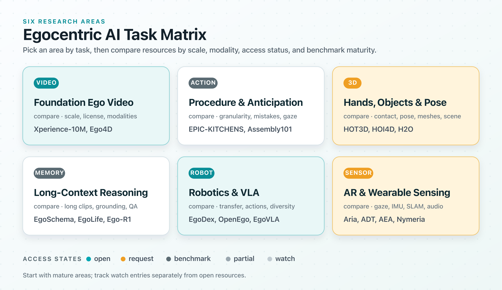
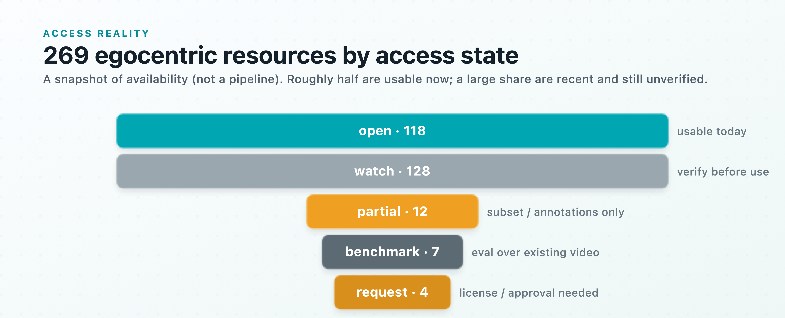

<p align="center">
  
</p>

<h1 align="center">Awesome Egocentric Atlas</h1>

<p align="center">
  
</p>

<p align="center">
  <strong>A curated map of first-person AI — datasets, benchmarks, models, and tools.</strong>
</p>

<!-- LANG-BAR:START -->
<p align="center">
  <a href="README.md"><b>English</b></a> ·
  <a href="README.zh.md">中文</a> ·
  <a href="README.es.md">Español</a> ·
  <a href="README.fr.md">Français</a> ·
  <a href="README.de.md">Deutsch</a> ·
  <a href="README.ja.md">日本語</a> ·
  <a href="README.ko.md">한국어</a> ·
  <a href="README.pt.md">Português</a> ·
  <a href="CONTRIBUTING.md">Help translate</a> ·
  <a href="https://chaoyue0307.github.io/awesome-egocentric-atlas/">Landing page</a> ·
  <a href="https://huggingface.co/datasets/cy0307/awesome-egocentric-atlas">Hugging Face mirror</a>
</p>
<!-- LANG-BAR:END -->

<p align="center">
  <a href="https://github.com/sindresorhus/awesome"></a>
  <a href="https://github.com/ChaoYue0307/awesome-egocentric-atlas/actions/workflows/validate.yml"></a>
  <a href="https://chaoyue0307.github.io/awesome-egocentric-atlas/"></a>
  <a href="https://huggingface.co/datasets/cy0307/awesome-egocentric-atlas"></a>
  <a href="data/resources.yml"></a>
  <a href="README.md#dataset-atlas"></a>
  <a href="README.md#models-tools-and-baselines"></a>
  <a href="LICENSE"></a>
  <a href="CONTRIBUTING.md"></a>
</p>

**Awesome Egocentric Atlas** maps the egocentric (first-person) AI landscape — datasets, benchmarks, models, and tools spanning egocentric vision, embodied AI and robotics, vision-language-action, world models, long-context memory, AR/VR, and hand-object interaction. Every entry shows its public-access status, so you can tell at a glance what you can download today and what is still just a paper.

**Updated:** 2026-06-19.
**Scope:** the main atlas is **human or animal first-person capture** from head, glasses, headset, body, wrist, handheld, or synchronized ego-exo rigs (where the ego view is central). Related but non-egocentric resources — robot-only datasets, multi-view robotic benchmarks, autonomous-driving 4D data, and general long-video reasoning — are listed separately under [Adjacent and Related Resources](#adjacent-and-related-resources) rather than in the main tables.

<p align="center">
  
</p>

## Contents

- [How to Use This Atlas](#how-to-use-this-atlas)
- [At a Glance](#at-a-glance)
- [Milestones](#milestones)
- [Start Here](#start-here)
- [Landscape Snapshot](#landscape-snapshot)
- [Creator and Release Notes](#creator-and-release-notes)
- [Status Legend](#status-legend)
- [Fast Task Map](#fast-task-map)
- [Recipes and Reference](#recipes-and-reference)
- [Dataset Atlas](#dataset-atlas)
- [Benchmarks and Derived Annotations](#benchmarks-and-derived-annotations)
- [Models, Tools, and Baselines](#models-tools-and-baselines)
- [Adjacent and Related Resources](#adjacent-and-related-resources)
- [Surveys, Papers, and Context](#surveys-papers-and-context)
- [Workshops and Challenges](#workshops-and-challenges)
- [Watchlist](#watchlist)
- [Inclusion Rules](#inclusion-rules)
- [Contributing](#contributing)
- [Cite This Atlas](#cite-this-atlas)

## How to Use This Atlas

Use the first two tables to orient yourself, then jump into the detailed atlas section that matches your task. Each entry is deliberately short: name, release date (year-month, from the first public/arXiv posting where known), venue (conference/journal where published, or `arXiv`/source for preprints), scale/signal, best use, and public status. For filtering by task, modality, status, or date, use the catalog in [`data/resources.yml`](data/resources.yml), where every entry carries a `released` field; label meanings and filter groups are explained in [docs/taxonomy.md](docs/taxonomy.md). Task-oriented [research recipes](#recipes-and-reference) walk you from goal to experiment.

Prefer a browsable view? The [interactive site](https://chaoyue0307.github.io/awesome-egocentric-atlas/) lets you filter the catalog by task, status, and date in eight languages, and the same catalog is mirrored as a dataset on [Hugging Face](https://huggingface.co/datasets/cy0307/awesome-egocentric-atlas).

<p align="center">
  
</p>

## At a Glance

| Signal | What it means for readers |
| :--- | :--- |
| 269 egocentric resources | 102 datasets, 69 benchmarks, 84 models, and 13 toolkits, plus a Project Aria collection hub — across vision, robotics, memory, and AR. Four related non-egocentric resources are listed separately. |
| 6 research lanes | Foundation video, procedure/action, hands and 3D, memory/reasoning, robotics/VLA, and AR/wearable sensing. |
| 5 access states | `open`, `request`, `benchmark`, `partial`, and `watch` keep availability visible before you plan experiments. |
| Machine-checked catalog | [`data/resources.yml`](data/resources.yml) mirrors the README with type, year, status, URL, tasks, and provenance — and CI validates it on every change. |
| Reader-first tables | Each entry is short enough to scan, then links out to the official page, paper, code, or dataset portal. |

<p align="center">
  
</p>

## Milestones

The landmark works that shaped egocentric AI — a fast on-ramp from the field's origins to its current frontier. Generated from entries tagged `milestone:` in [`data/resources.yml`](data/resources.yml).

<!-- MILESTONES:START (generated by build_artifacts.rb — do not edit by hand) -->

| Date | Milestone | Why it matters |
| :---: | :--- | :--- |
| 2009 | [CMU-MMAC](http://kitchen.cs.cmu.edu/) | The earliest egocentric dataset; launched first-person activity recognition at the first IEEE Workshop on Egocentric Vision (CVPR 2009). |
| 2011-06 | [GTEA / GTEA Gaze / EGTEA Gaze+](https://cbs.ic.gatech.edu/fpv/) | Foundational hand-object and gaze egocentric activity datasets (GTEA, CVPR 2011) that seeded first-person action and attention research. |
| 2020-06 | [EPIC-KITCHENS-100](https://epic-kitchens.github.io/) | The defining large-scale egocentric action-recognition benchmark and annual challenge suite. |
| 2021-10 | [Ego4D](https://ego4d-data.org/) | The 3,670-hour massive-scale benchmark suite that catalyzed the modern egocentric era. |
| 2022 | [Project Aria Datasets](https://www.projectaria.com/datasets/) | Meta's research smart-glasses platform that opened the modern wave of AR and wearable egocentric data. |
| 2022-06 | [EgoVLP](https://github.com/showlab/EgoVLP) | First egocentric video-language pretraining (EgoClip, EgoNCE) and a basis for ego representation learning. |
| 2023-08 | [EgoSchema](http://egoschema.github.io/) | The benchmark that exposed how far models are from long-form egocentric video reasoning. |
| 2023-11 | [Ego-Exo4D](https://ego-exo4d-data.org/) | Synchronized ego and exo skilled-activity capture at scale; the reference for cross-view egocentric learning. |
| 2024-06 | [HOT3D](https://facebookresearch.github.io/hot3d/) | Reference benchmark for 3D hand-object tracking from AR glasses (Project Aria and Quest 3). |
| 2025-07 | [EgoVLA](https://rchalyang.github.io/EgoVLA/) | Showed vision-language-action policies can be learned from egocentric human video and transferred to robots. |
| 2026-02 | [EgoScale](https://arxiv.org/abs/2602.16710) | Revealed the log-linear data-scaling law for egocentric human-video VLA pretraining. |
| 2026-03 | [Xperience-10M](https://huggingface.co/datasets/ropedia-ai/xperience-10m) | Petascale egocentric world-model corpus (10M experiences, ~1 PB) pushing first-person data to internet scale for embodied AI and robot learning. |

<!-- MILESTONES:END -->

## Start Here

| Reader | Best first move | Then go deeper |
| :--- | :--- | :--- |
| New to egocentric vision | Read Ego4D, EPIC-KITCHENS-100, Ego-Exo4D, and EgoSchema first. | Add EgoClip/EgoVLP for video-language, VISOR for masks, and HOT3D/HOI4D for 3D hand-object work. |
| Building a benchmark table | Start from the `open` and `benchmark` entries, then inspect `request` licenses. | Use the YAML catalog to filter by task and modality. |
| Building an assistant or agent | Start with Ego4D, Xperience-10M, EgoLife, TeleEgo, EgoSchema, MyEgo, EgoIntrospect, EgoBench, UCS-Bench, and Ego2Web. | Track Ego-R1, X-LeBench, EgoMemReason, StreamMemBench, ReFocus, EgoCoT-Bench, EgoBlind, EgoSound, and NoRA for reasoning diagnostics. |
| Building a robot/VLA system | Start with Xperience-10M, EgoDex, EgoVerse, Ego-Exo4D, HoloAssist, HOI4D, HOT3D, Assembly101, OpenEgo, UMI, FastUMI-100K, EgoPAT3D, HUG, and WiYH. | Add Dobb-E, FastUMI, MV-UMI, UMIGen, YUBI, Hoi!, EgoVLA, EgoEngine, HumanEgo, EgoGuide, Ego-Pi, EgoAERO, H2O, ARCTIC, HOMIE-toolkit, Xperience task baselines, and EgoHandTrajPred for policy/action supervision. For robot-only corpora see [Adjacent and Related](#adjacent-and-related-resources). |
| Studying hands, objects, and 3D | Start with HOT3D, HOI4D, H2O, ARCTIC, FPHA, EgoHOS, EgoBody, GIMO, EgoHumans, EgoTactile, and UnrealEgo. | Add EgoTracks/TREK-150 for tracking, EgoForce for monocular 3D hand pose, and EgoEMG/EgoEVHands/EgoPressDiff for emerging sensors and contact. |

## Landscape Snapshot

<p align="center">
  
</p>

| Lane | What to compare | Canonical anchors |
| :--- | :--- | :--- |
| Foundation video | scale, license, modalities, benchmark maturity | Xperience-10M, Ego4D, Ego-Exo4D, EPIC-KITCHENS-100, EgoClip |
| Procedure and action | action granularity, mistakes, anticipation, gaze | EPIC-KITCHENS, Assembly101, MECCANO, EgoProceL, HoloAssist |
| Hand-object and 3D | hands, objects, contact, pose, meshes, scene geometry | HOT3D, HOI4D, H2O, ARCTIC, FPHA, EgoHOS |
| Memory and reasoning | clip length, grounding, QA type, streaming constraints | EgoSchema, EgoLife, TeleEgo, MyEgo, X-LeBench, EgoMemReason, UCS-Bench, StreamMemBench, EgoSound, Ego-R1 |
| Robotics and VLA | action labels, hand trajectories, robot transfer, task diversity | Xperience-10M, EgoDex, EgoVerse, OpenEgo, UMI, FastUMI-100K, YUBI, EgoPAT3D, HUG, WiYH, EgoVLA |
| AR/wearable sensing | gaze, IMU, SLAM, audio, physiological signals | Project Aria, ADT, AEA, Nymeria, PROSE, EgoIntrospect, EasyCom |

> **Origins.** Egocentric vision grew out of wearable computing: [Steve Mann](http://wearcam.org/) pioneered continuous first-person ("sousveillance") cameras through the 1980s–90s and is widely credited with opening up the field, and Microsoft's SenseCam (2006) popularized lifelogging capture. The modern computer-vision wave began at the first IEEE Workshop on Egocentric Vision (CVPR 2009), where Spriggs, De La Torre, and Hebert introduced egocentric activity recognition on the [CMU-MMAC](http://kitchen.cs.cmu.edu/) database (2009) — the earliest dataset in this atlas — followed by the foundational GTEA (2011) and ADL (2012) datasets that launched first-person activity and object research.

## Creator and Release Notes

| Resource | Created / stewarded by | Release channel and access note |
| :--- | :--- | :--- |
| [Xperience-10M](https://huggingface.co/datasets/ropedia-ai/xperience-10m) | Ropedia | Released under `ropedia-ai` on Hugging Face. Full dataset uses controlled non-commercial access; the [sample](https://huggingface.co/datasets/ropedia-ai/xperience-10m-sample) is open, [HOMIE-toolkit](https://github.com/Ropedia/HOMIE-toolkit) loads/visualizes annotations, and [Xperience task baselines](https://huggingface.co/cy0307/ropedia-xperience-10m-task-baselines) provide a public evaluation artifact. |
| [Ego4D](https://ego4d-data.org/) | Meta AI / Facebook AI with an international academic consortium | Official data portal with license-gated downloads and benchmark tasks. |
| [Ego-Exo4D](https://ego-exo4d-data.org/) | Meta and academic partners across the Ego-Exo4D consortium | Official data portal with application/download tooling for synchronized ego-exo data. |
| [EPIC-KITCHENS](https://epic-kitchens.github.io/) | University of Bristol-centered EPIC-KITCHENS team | Official challenge/dataset portal with public annotations and benchmark splits. |
| [Project Aria datasets](https://www.projectaria.com/datasets/) | Meta / Project Aria | Official Project Aria dataset portal and tooling for AR-glasses sensor data. |

## Status Legend

| Status | Meaning |
| :---: | :--- |
| `open` | Public download, public annotations, public code, or application-based access is clearly documented. |
| `request` | Public project exists, but dataset access requires license, form, approval, or institutional agreement. |
| `benchmark` | Mainly a benchmark, challenge, labels, or evaluation over existing videos. |
| `partial` | Some assets are public, but full raw data, license, or long-term availability is unclear. |
| `watch` | Recent or important resource whose release state still needs verification. |

For how each status is decided, see [docs/status_policy.md](docs/status_policy.md).

<p align="center">
  
</p>

## Fast Task Map

| Research goal | Strong starting points |
| :--- | :--- |
| General egocentric foundation data | [Xperience-10M](https://huggingface.co/datasets/ropedia-ai/xperience-10m), [Ego4D](https://ego4d-data.org/), [Ego-Exo4D](https://ego-exo4d-data.org/), [EPIC-KITCHENS-100](https://epic-kitchens.github.io/), [EgoClip](https://github.com/showlab/EgoVLP) |
| Ego-exo and skill learning | [Ego-Exo4D](https://ego-exo4d-data.org/), [EgoExoLearn](https://github.com/OpenGVLab/EgoExoLearn), [Assembly101](https://assembly-101.github.io/), [Look and Tell](https://arxiv.org/abs/2510.22672) |
| Robot manipulation / VLA | [Xperience-10M](https://huggingface.co/datasets/ropedia-ai/xperience-10m), [EgoDex](https://arxiv.org/abs/2505.11709), [EgoVerse](https://egoverse.ai/), [OpenEgo](https://arxiv.org/abs/2509.05513), [UMI](https://umi-gripper.github.io/), [FastUMI-100K](https://huggingface.co/datasets/IPEC-COMMUNITY/FastUMI_100k_lerobot), [YUBI](https://arxiv.org/abs/2606.10244), [HUG](https://grasping.io/), [EgoVLA](https://rchalyang.github.io/EgoVLA/), [EgoEngine](https://egoengine.github.io/), [HumanEgo](https://humanego-ai.github.io) |
| Long-context QA and memory | [EgoSchema](http://egoschema.github.io/), [EgoLife](https://arxiv.org/abs/2503.03803), [EgoMemReason](https://arxiv.org/abs/2605.09874), [UCS-Bench](https://github.com/cocowy1/UCS-Bench), [StreamMemBench](https://arxiv.org/abs/2606.14571), [Ego-EXTRA](https://fpv-iplab.github.io/Ego-EXTRA/), [EgoStream](https://arxiv.org/abs/2605.31557), [EgoBench](https://arxiv.org/abs/2605.27820) |
| Hand-object and 3D HOI | [HOT3D](https://facebookresearch.github.io/hot3d/), [HOI4D](https://hoi4d.github.io/), [EgoHOS](https://github.com/owenzlz/EgoHOS), [FPHA](https://guiggh.github.io/publications/first-person-hands/), [HUG](https://grasping.io/), [EgoTactile](https://egotactile.github.io/), [EgoForce](https://dfki-av.github.io/EgoForce), [EgoEMG](https://arxiv.org/abs/2605.05712) |
| Audio, speech, and social interaction | [Ego4D AV tasks](https://ego4d-data.org/), [EasyCom](https://arxiv.org/abs/2107.04174), [EgoCom / audio-visual correspondence](http://vision.cs.utexas.edu/projects/ego_av_corr/), [AV-CONV](https://vjwq.github.io/AV-CONV/) |
| AR glasses and scene understanding | [Project Aria Datasets](https://www.projectaria.com/datasets/), [Aria Digital Twin](https://www.projectaria.com/datasets/adt/), [AEA](https://www.projectaria.com/datasets/aea/), [Nymeria](https://www.projectaria.com/datasets/nymeria/), [DTC](https://www.projectaria.com/datasets/dtc/) |

## Recipes and Reference

Task-oriented starting points and the references that keep the catalog usable.

**Research recipes** — each gives a goal, what to start with, what to add, benchmarks, baselines, a minimum viable experiment, common pitfalls, and a reporting checklist:

- [Long-context egocentric video QA](docs/recipes/long-context-egocentric-qa.md)
- [Robot / VLA from egocentric human video](docs/recipes/robot-vla-from-ego-video.md)
- [Hand-object 3D HOI](docs/recipes/hand-object-3d-hoi.md)
- [AR-glasses and wearable sensing](docs/recipes/ar-glasses-sensing.md)
- [Audio and social egocentric understanding](docs/recipes/audio-social-egocentric.md)

**Reference**

- [Taxonomy](docs/taxonomy.md) — task/modality families and how to filter the catalog.
- [Access Matrix](docs/access_matrix.md) — data, code, license, and leaderboard per key resource.
- [Status Policy](docs/status_policy.md) — how `open`/`request`/`benchmark`/`partial`/`watch` are decided.
- [Resource Schema](docs/resource_schema.md) — every field in `data/resources.yml`.
- [Maintenance](docs/maintenance.md) — the add → verify → validate workflow.

## Dataset Atlas

### Foundational and Large-Scale Ego Video

Broad, large-scale first-person corpora that most egocentric pipelines pretrain or benchmark on.

| Resource | Released | Venue | Scale / signal | Best for | Status |
| :--- | :---: | :---: | :--- | :--- | :---: |
| [Ego-1K](https://huggingface.co/datasets/facebook/ego-1k) | 2026-03 | CVPR 2026 | Nearly 1,000 synchronized multiview egocentric videos from a custom 12-camera plus VR-headset rig | Dynamic 3D/4D scene understanding and novel view synthesis from ego rigs | open |
| [EgoCrowds / CrowdEraser](https://arxiv.org/abs/2603.29036) | 2026-03 | arXiv | Semi-synthetic paired crowded/empty clips from real egocentric walking-tour video; CrowdEraser diffusion removes crowds for humanless walkthroughs | First-person walking-tour video editing and environment modeling | watch |
| [Xperience-10M](https://huggingface.co/datasets/ropedia-ai/xperience-10m) | 2026 | Hugging Face | Ropedia release on Hugging Face; 10M experiences, 10K hours, six video streams, audio, stereo depth, camera pose, hand/body mocap, IMU, hierarchical language, ~1 PB total | Embodied AI, world models, robot learning from human experience, sensor fusion, 3D/4D understanding | request |
| [Xperience-10M Sample](https://huggingface.co/datasets/ropedia-ai/xperience-10m-sample) | 2026 | Hugging Face | Public sample episode for Xperience-10M with six rows on Hugging Face and `cc-by-nc-4.0` terms | Loader testing, demos, task-suite prototyping, annotation inspection | open |
| [Look and Tell](https://arxiv.org/abs/2510.22672) | 2025-10 | NeurIPS 2025 Workshop | 25 participants, Project Aria plus stationary cameras, gaze/speech/video, 3D reconstructions | Referential communication across ego and exo viewpoints | watch |
| [EgoBlind](https://arxiv.org/abs/2503.08221) | 2025-03 | NeurIPS 2025 D&B | 1,392 first-person videos from blind and visually impaired users, 5,311 questions posed or verified by blind users | Assistive egocentric VideoQA for blind users | watch |
| [HD-EPIC](https://arxiv.org/abs/2502.04144) | 2025-02 | CVPR 2025 | 41 hours, 9 kitchens, dense fine-grained labels, 3D fixture annotations, audio events, VQA | Detailed kitchen understanding, VQA, 3D-aware ego reasoning, audio-event recognition | open |
| [EgoVid-5M](https://egovid.github.io/) | 2024-11 | NeurIPS 2025 | 5M curated egocentric clips at 1080p with fine-grained kinematic and high-level text action annotations (NeurIPS 2025) | Egocentric video generation and action-conditioned world models | open |
| [Ego-Exo4D](https://ego-exo4d-data.org/) | 2023-11 | CVPR 2024 | 1,286 hours, 740 participants, synchronized first- and third-person views, audio, gaze, IMU, 3D point clouds, language commentary | Skilled activity, ego-exo transfer, cross-view translation, pose, proficiency, robotics | request |
| [HoloAssist](https://holoassist.github.io/) | 2023-09 | ICCV 2023 | 166 hours, 350 instructor-performer pairs, 7 synchronized streams from mixed-reality headsets | Interactive assistance, mistake detection, intervention prediction, procedural collaboration | open |
| [EgoObjects](https://github.com/facebookresearch/EgoObjects) | 2023-09 | ICCV 2023 | Pilot release with 9K+ videos, 250 participants, 50+ countries, 650K annotations, 368 categories | Category and instance-level egocentric object understanding, continual object detection | open |
| [Assembly101](https://assembly-101.github.io/) | 2022-03 | CVPR 2022 | 4,321 videos, 8 static plus 4 egocentric views, 100K coarse and 1M fine action segments, 18M 3D hand poses | Procedural action, anticipation, mistake detection, cross-view transfer | open |
| [Ego4D](https://ego4d-data.org/) | 2021-10 | CVPR 2022 | 3,670+ hours from 900+ camera wearers, multiple countries, video/audio/gaze/stereo/3D/narrations depending on subset | Long-form ego video, episodic memory, social, hand-object, forecasting, audio-visual tasks | request |
| [EasyCom](https://arxiv.org/abs/2107.04174) | 2021-07 | arXiv | AR glasses egocentric multi-channel audio and wide-FOV RGB for noisy conversations | Speech enhancement, source localization, conversation assistance | open |
| [EPIC-KITCHENS-100](https://epic-kitchens.github.io/) | 2020-06 | IJCV 2022 | 100 hours, 20M frames, 90K actions, 45 kitchens, narrations and dense action labels | Kitchen action recognition, anticipation, action detection, retrieval | open |
| [EgoCom / Ego audio-visual correspondence](http://vision.cs.utexas.edu/projects/ego_av_corr/) | 2020 | project page | Egocentric video with spatial audio for conversation and audio-visual correspondence tasks | Active speaker detection, spatial audio denoising, conversational graph reasoning | open |

### Robotics, Manipulation, and VLA

Egocentric human-manipulation and wrist-camera data aimed at vision-language-action models and human-to-robot transfer.

| Resource | Released | Venue | Scale / signal | Best for | Status |
| :--- | :---: | :---: | :--- | :--- | :---: |
| [YUBI](https://arxiv.org/abs/2606.10244) | 2026-06 | arXiv | Reported 8,434 hours, 1.20M episodes, and 119 tasks from a finger-aligned UMI-style bimanual interface | Scalable bimanual dexterous data collection | watch |
| [EgoEngine](https://egoengine.github.io/) | 2026-06 | arXiv | Converts egocentric human manipulation videos into high-fidelity robot observation videos and executable robot action trajectories | Human-to-robot data generation, dexterous imitation | watch |
| [EgoAERO](https://arxiv.org/abs/2606.08057) | 2026-06 | arXiv | Asset-free conversion from a single egocentric RGB-D demonstration; introduces EgoDex-R in the paper | Single-demo dexterous robot learning | watch |
| [1M-HUGs / HUG](https://grasping.io/) | 2026-06 | arXiv | 1M frames / 27.8 hours of smart-glasses human grasps over 6,707 object instances, plus HUG-Bench with 90 unseen objects | Human grasp modeling and zero-shot robot grasping | open |
| [EgoVerse](https://egoverse.ai/) | 2026-04 | arXiv | 1,362 hours, 80K episodes, 1,965 tasks, 240 scenes, 2,087 demonstrators | Human demonstration scaling for robot learning and VLA | watch |
| [EgoLive](https://arxiv.org/abs/2604.23570) | 2026-04 | arXiv | Large-scale real-world task-oriented egocentric routines for robot manipulation | Home service, retail, and real-world work-task manipulation | watch |
| [HRDexDB](https://arxiv.org/abs/2604.14944) | 2026-04 | arXiv | 1.4K human/robot grasping trials, tactile, multiview video, egocentric video streams | Cross-domain dexterous grasp learning | watch |
| [AoE: Always-on Egocentric](https://arxiv.org/abs/2602.23893) | 2026-02 | arXiv | Always-on egocentric human-video collection pipeline and corpus for embodied AI | Scaling human-video data for robot learning | watch |
| [EgoScale](https://arxiv.org/abs/2602.16710) | 2026-02 | arXiv | 20,854 hours of action-labeled egocentric human video with a human-to-robot two-stage transfer recipe and a log-linear data-scaling law | Scaling dexterous manipulation from human video | watch |
| [World in Your Hands / WiYH](https://arxiv.org/abs/2512.24310) | 2025-12 | arXiv | Reported 1,000-hour egocentric manipulation ecosystem with multiview/depth/hand/wrist signals | VLA, manipulation representation learning | watch |
| [Hoi!](https://arxiv.org/abs/2512.04884) | 2025-12 | arXiv | 3,048 force-grounded articulated-manipulation sequences over human, wrist-camera, UMI, and Hoi-gripper embodiments | Force/contact-grounded cross-view manipulation | watch |
| [UMIGen](https://arxiv.org/abs/2511.09302) | 2025-11 | arXiv | Cloud-UMI plus visibility-aware egocentric point-cloud generation | 3D-aware cross-embodiment imitation learning | watch |
| [FastUMI-100K](https://huggingface.co/datasets/IPEC-COMMUNITY/FastUMI_100k_lerobot) | 2025-10 | arXiv | 100K+ UMI-style trajectories across 54 tasks in LeRobot format with multi-view wrist fisheye images | Large-scale UMI-style robot policy training | open |
| [OpenEgo](https://arxiv.org/abs/2509.05513) | 2025-09 | arXiv | 1,107 hours unified across six public egocentric datasets, 290 manipulation tasks, hand-pose/action primitives | Standardized dexterous manipulation pretraining and evaluation | watch |
| [MV-UMI](https://arxiv.org/abs/2509.18757) | 2025-09 | arXiv | Multi-view UMI adds third-person context to wrist egocentric observations | Broad-scene context for cross-embodiment manipulation | watch |
| [InterVLA](https://arxiv.org/abs/2508.04681) | 2025-08 | ICCV 2025 | 11.4 hours and 1.2M frames with 2 ego and 5 exo views, human/object motions, and verbal commands | Vision-language-action and motion estimation | watch |
| [EgoDex](https://arxiv.org/abs/2505.11709) | 2025-05 | ICLR 2026 | 829 hours of Apple Vision Pro egocentric video, 194 tabletop tasks, 3D hand/finger tracking | Dexterous manipulation, imitation learning, human-to-robot hand trajectory prediction | watch |
| [EgoVLA](https://rchalyang.github.io/EgoVLA/) | 2025 | project page | VLA training from egocentric human videos plus robot fine-tuning | Human-video-to-robot policy transfer | watch |
| [FastUMI](https://arxiv.org/abs/2409.19499) | 2024-09 | arXiv | UMI redesign reporting 10K+ real-world trajectories across 22 everyday tasks | Faster hardware-independent UMI-style collection | watch |
| [EgoPAT3D / EgoPAT3Dv2](https://arxiv.org/abs/2403.05046) | 2024-03 | ICRA 2024 | 1M+ RGB-D/IMU frames in the original task; v2 expands egocentric 3D action-target prediction | Human-robot interaction, 3D target anticipation, manipulation safety | open |
| [Universal Manipulation Interface / UMI](https://umi-gripper.github.io/) | 2024-02 | RSS 2024 | Hand-held GoPro gripper interface and policy stack for in-the-wild robot teaching | Wrist-view robot-free demonstrations and cross-embodiment policy transfer | open |
| [Dobb-E / HoNY](https://dobb-e.com/) | 2023-11 | arXiv | 13 hours, 22 homes, 5,620 trajectories, and 1.5M RGB-D frames collected with an iPhone-based Stick | Household robot learning from handheld in-home demonstrations | partial |

### Hands, Objects, Pose, Tracking, and 3D

Fine-grained hand, object, contact, and 3D-pose datasets, including emerging event-camera and EMG sensing.

| Resource | Released | Venue | Scale / signal | Best for | Status |
| :--- | :---: | :---: | :--- | :--- | :---: |
| [A multimodal RGB/events FPV hand dataset](https://arxiv.org/abs/2606.10790) | 2026-06 | arXiv | Synthetic event-based first-person hand detection from EgoHands plus v2e | Event/RGB hand detection benchmarking | watch |
| [EgoEMG](https://arxiv.org/abs/2605.05712) | 2026-05 | arXiv | 41 participants, bilateral EMG, IMU, RGB, external RGB-D, mocap hand labels | EMG plus egocentric vision hand pose estimation | watch |
| [EgoTouch / TouchAnything](https://jianyi2004.github.io/TouchAnything-Website/) | 2026-05 | arXiv | 302 tasks, 4,530 episodes with egocentric + dual wrist cameras, bimanual 3D hand pose, and dense tactile pressure maps | Tactile estimation and contact modeling from egocentric video | watch |
| [TouchMoment](https://arxiv.org/abs/2604.12343) | 2026-04 | CVPR 2026 Findings | 4,021 egocentric videos, 8,456 annotated hand-object contact moments | Precise contact moment detection | watch |
| [EgoFun3D](https://arxiv.org/abs/2604.11038) | 2026-04 | arXiv | 271 egocentric videos with 3D geometry, part segmentation, articulation and function-template annotations | Interactive 3D object modeling from ego video | watch |
| [SHOW3D](https://arxiv.org/abs/2603.28760) | 2026-03 | CVPR 2026 | In-the-wild 3D hand-object interactions from a back-mounted multi-camera rig synced to a worn VR headset, with multi-view 3D shape/pose and text | In-the-wild 3D hand-object reconstruction | watch |
| [EgoXtreme](https://arxiv.org/abs/2603.25135) | 2026-03 | arXiv | Smart-glasses egocentric 6D object-pose dataset across industrial, sports, and rescue scenes with extreme motion blur, dynamic lighting, and occlusion | Robust 6D object pose under extreme egocentric conditions | watch |
| [Egocentric HOI Detection](https://arxiv.org/abs/2506.14189) | 2025-06 | arXiv | New benchmark and method for detecting hand-object interactions in egocentric video | Egocentric hand-object interaction detection | open |
| [EgoBrain](https://arxiv.org/abs/2506.01353) | 2025-06 | arXiv | Synchronized EEG and egocentric video for human action understanding | Brain-signal plus first-person action understanding | watch |
| [EventEgoHands](https://arxiv.org/abs/2505.19169) | 2025-05 | arXiv | Event-based egocentric 3D hand mesh reconstruction benchmark over N-HOT3D | Low-light and motion-blur hand reconstruction | watch |
| [EgoPressure](https://yiming-zhao.github.io/EgoPressure/) | 2024-09 | CVPR 2025 | 5.0 hours, 21 participants, a moving egocentric camera plus 7 stationary RGB-D cameras, hand pose meshes, and fine-grained per-contact touch pressure (CVPR 2025) | Hand pressure and pose from egocentric vision | open |
| [HOT3D](https://facebookresearch.github.io/hot3d/) | 2024-06 | CVPR 2025 | 833+ minutes, 3.7M+ images, Aria and Quest 3, gaze, point clouds, 3D hand/object/camera poses | 3D hand-object tracking for AR/VR manipulation | open |
| [UnrealEgo2 / UnrealEgo-RW](https://arxiv.org/abs/2401.00889) | 2024-01 | arXiv | Expanded stereo egocentric pose datasets from synthetic and real-world capture | Stereo egocentric human pose estimation | watch |
| [EgoEVHands](https://github.com/ZJUWang01/EgoEV-HandPose) | 2024 | GitHub | Stereo event-camera egocentric hand dataset with 5,419 sequences and 3D/2D keypoints | Event-based bimanual hand pose and gesture recognition | watch |
| [EgoHumans](https://arxiv.org/abs/2305.16487) | 2023-05 | ICCV 2023 | 125K+ egocentric images for in-the-wild multi-human tracking, 2D/3D pose, and mesh recovery | Egocentric multi-human perception and tracking | partial |
| [EgoTracks](https://arxiv.org/abs/2301.03213) | 2023-01 | NeurIPS 2023 | Long-term egocentric visual object tracking annotations from Ego4D | Tracking, re-detection, embodied object persistence | open |
| [EgoGTA / EgoPW-Scene](https://arxiv.org/abs/2212.11684) | 2022-12 | arXiv | Synthetic EgoGTA plus EgoPW-based in-the-wild scene-aware pose data | Scene-aware egocentric 3D human pose estimation | partial |
| [EgoHOS](https://github.com/owenzlz/EgoHOS) | 2022-08 | ECCV 2022 | 11,243 egocentric images with detailed hand/object/contact segmentation | Hand-object segmentation and contact-aware foreground modeling | open |
| [UnrealEgo](https://4dqv.mpi-inf.mpg.de/UnrealEgo/) | 2022-08 | ECCV 2022 | Synthetic stereo eyeglass egocentric dataset with 3D human pose | Robust egocentric 3D human motion capture | open |
| [Ego2HandsPose](https://arxiv.org/abs/2206.04927) | 2022-06 | arXiv | Extension of Ego2Hands with 3D global hand pose annotations | Two-hand RGB 3D pose in global coordinates | open |
| [ARCTIC](https://arctic.is.tue.mpg.de/) | 2022-04 | CVPR 2023 | 2.1M frames with bimanual hand/object meshes, articulated objects, and contact | Dexterous bimanual manipulation, contact, reconstruction | request |
| [GIMO](https://github.com/y-zheng18/GIMO) | 2022-04 | ECCV 2022 | Ego-centric views, gaze, scene scans, and high-quality body pose sequences | Gaze-informed human motion prediction in scene context | open |
| [HOI4D](https://hoi4d.github.io/) | 2022-03 | CVPR 2022 | 2.4M RGB-D egocentric frames, 4,000+ sequences, 800 objects, 16 categories, 610 rooms | 4D human-object interaction, segmentation, object pose tracking, action segmentation | open |
| [EgoBody](https://sanweiliti.github.io/egobody/egobody.html) | 2022 | ECCV 2022 | HoloLens2 egocentric RGB/depth/eye/head/hand data with 3D body pose and shape | Egocentric human pose, shape, motion, social interaction | open |
| [H2O: Two Hands and Objects](https://arxiv.org/abs/2104.11181) | 2021-04 | ICCV 2021 | Synchronized multi-view RGB-D, two-hand 3D pose, 6D object pose, object meshes, camera poses | First-person two-hand interaction recognition and pose-aware HOI | open |
| [TREK-150](https://machinelearning.uniud.it/datasets/trek150/) | 2021 | project page | 150 egocentric tracking sequences derived from EPIC-KITCHENS | Single-object tracking in egocentric video | open |
| [Ego2Hands](https://arxiv.org/abs/2011.07252) | 2020-11 | arXiv | Large-scale composited RGB egocentric two-hand segmentation/detection | Robust unconstrained hand segmentation | open |
| [xR-EgoPose](https://github.com/facebookresearch/xR-EgoPose) | 2019 | GitHub | Synthetic egocentric body pose data for XR headset viewpoints | 3D human pose from head-mounted cameras | open |
| [FPHA / First-Person Hand Action](https://guiggh.github.io/publications/first-person-hands/) | 2017 | CVPR 2018 | 100K+ RGB-D frames, 45 action classes, 26 objects, 3D hand/object poses | 3D hand pose and first-person hand action recognition | open |
| [EgoGesture](https://ieeexplore.ieee.org/document/8299578/) | 2017 | IEEE TMM 2018 | 24K+ gesture samples, 3M RGB-D frames, 50 subjects, 83 static and dynamic gestures across six scenes | First-person gesture recognition for wearable interaction | open |
| [EgoHands](http://vision.soic.indiana.edu/projects/egohands/) | 2015 | ICCV 2015 | 48 Google Glass videos, 4,800 annotated hand images | Hand detection and segmentation | open |
| [BEOID](https://dimadamen.github.io/BEOID/) | 2014 | BMVC 2014 | Gaze-tracked egocentric video of 8 users interacting with objects across 6 everyday locations (kitchen, workspace, printer, corridor, gym) | Discovering task-relevant objects and interaction modes | open |

### Daily Life, Memory, Assistance, and QA

Long-horizon daily-life capture and the question-answering benchmarks that probe memory, reasoning, and assistance.

| Resource | Released | Venue | Scale / signal | Best for | Status |
| :--- | :---: | :---: | :--- | :--- | :---: |
| [Causal-Plan-1M](https://arxiv.org/abs/2606.01810) | 2026-06 | arXiv | Reported million-scale corpus of explicit causal reasoning traces over egocentric videos | Causal and planning-oriented ego reasoning | watch |
| [NoRA](https://arxiv.org/abs/2606.04806) | 2026-06 | arXiv | 1,420 first-person video clips for normative action reasoning with fact-reason-action support graphs | Grounded reasonableness and safety-oriented action generation | watch |
| [Pause and Think](https://arxiv.org/abs/2606.00616) | 2026-06 | arXiv | Reasoning-centric training data and benchmark for video-grounded assistive action suggestions | Scene-grounded assistance, planning, and temporal consistency | watch |
| [SuperMemory-VQA](https://arxiv.org/abs/2606.00825) | 2026-06 | arXiv | 52.9 hours of AI-glasses activity with RGB, audio, gaze, IMU, SLAM, and 4,853 human-verified QA pairs across object/location/intent/scene memory | Long-horizon memory for AR assistants | watch |
| [EgoMemReason](https://arxiv.org/abs/2605.09874) | 2026-05 | arXiv | 500 questions over week-long egocentric video with entity, event, and behavior memory types | Memory-driven reasoning across sparse evidence over hours or days | watch |
| [EgoBench](https://arxiv.org/abs/2605.27820) | 2026-05 | arXiv | 1,045 egocentric-video-grounded interactive tasks with tools and simulated users | Tool-using multimodal agents with dynamic interaction | watch |
| [EgoIntrospect](https://ego-introspect.github.io/) | 2026-05 | arXiv | 180 hours from 60 subjects with synchronized video, audio, gaze, motion, physiological signals | Internal-state reasoning, affect, intent, cognitive memory for wearable assistants | watch |
| [EgoExoMem](https://arxiv.org/abs/2605.18734) | 2026-05 | arXiv | 2.6K MCQs across synchronized ego-exo videos | Cross-view memory reasoning | watch |
| [EgoCoT-Bench](https://dstardust.github.io/EgoCoT/) | 2026-05 | arXiv | 3,172 verifiable QA pairs over 351 videos with operation-centric rationale annotations | Grounded chain-of-thought and evidence consistency | open |
| [EgoStream](https://arxiv.org/abs/2605.31557) | 2026-05 | arXiv | 2,250 questions across seven memory dimensions with Answer Validity Windows, expanded to 8,528 recall-conditioned evaluations over streams up to 45.3 hours | Diagnosing streaming episodic memory | watch |
| [MyEgo](https://github.com/Ryougetsu3606/MyEgo) | 2026-04 | CVPR 2026 | 541 long videos and 5K personalized questions about the camera wearer, belongings, activities, and past | Personalized ego-grounding and long-range memory QA | open |
| [EgoEsportsQA](https://arxiv.org/abs/2604.12320) | 2026-04 | arXiv | 1,745 QA pairs from professional first-person shooter matches across three games | High-speed first-person perception and tactical reasoning in virtual environments | watch |
| [EgoEverything](https://arxiv.org/abs/2604.08342) | 2026-04 | arXiv | 5,000+ MCQ pairs over 100+ hours, with gaze-attention-inspired question generation for AR | Human-behavior-inspired long-context egocentric understanding | watch |
| [EgoTL](https://arxiv.org/abs/2604.09535) | 2026-04 | arXiv | Think-aloud (say-before-act) egocentric capture with word-level spoken reasoning and metric-scale spatial annotations over 100+ household tasks | Long-horizon reasoning for VLMs and world models | watch |
| [MA-EgoQA](https://ma-egoqa.github.io/) | 2026-03 | arXiv | 1.7K questions over multiple long-horizon egocentric streams | Multi-agent egocentric memory reasoning | open |
| [Ego2Web](https://arxiv.org/abs/2603.22529) | 2026-03 | CVPR 2026 | Egocentric videos paired with web tasks requiring physical-scene understanding and online execution | Web agents grounded in first-person physical context | watch |
| [Gesture-Based Egocentric Video QA](https://arxiv.org/abs/2603.12533) | 2026-03 | CVPR 2026 | Egocentric video QA grounded in the camera wearer's pointing and deictic gestures | Gesture-grounded referential QA | watch |
| [EgoIntent](https://arxiv.org/abs/2603.12147) | 2026-03 | arXiv | 3,014 steps over 15 daily-life scenarios for local intent (What), global intent (Why), and next-step plan (Next) | Step-level intent and anticipatory assistance | watch |
| [EgoGraph](https://arxiv.org/abs/2602.23709) | 2026-02 | arXiv | Dynamic temporal knowledge graph framework evaluated on EgoLifeQA and EgoR1-bench | Training-free ultra-long egocentric video memory | watch |
| [EgoSound](https://arxiv.org/abs/2602.14122) | 2026-02 | CVPR 2026 | 7,315 validated QA pairs across 900 Ego4D/EgoBlind videos | Sound perception, spatial localization, causal audio-visual reasoning | watch |
| [SuperGlasses](https://arxiv.org/abs/2602.22683) | 2026-02 | CVPR 2026 Findings | Evaluates VLMs as intelligent agents for AI smart glasses across realistic wearable assistant tasks | Smart-glasses agent evaluation | watch |
| [Egocentric Clinical Intent](https://arxiv.org/abs/2601.06750) | 2026-01 | arXiv | Benchmark for egocentric clinical intent understanding by medical multimodal LLMs over first-person clinical procedure video | Clinical intent reasoning for medical assistants | watch |
| [WearVox](https://arxiv.org/abs/2601.02391) | 2026-01 | arXiv | Egocentric multichannel voice-assistant benchmark for spoken interaction grounded in first-person audio-visual context | Wearable voice-assistant evaluation | watch |
| [EgoMemory](https://openreview.net/forum?id=T0em4hJCQb) | 2026 | OpenReview | 165,795 user-specific object annotations over 245 videos from 45 participants | Memory-augmented personalized retrieval | watch |
| [Ego-EXTRA](https://fpv-iplab.github.io/Ego-EXTRA/) | 2025-12 | arXiv | 50 hours of expert-trainee procedural assistance dialogue, 15K+ VQA pairs | Egocentric video-language assistants and expert feedback | open |
| [WearVQA](https://arxiv.org/abs/2511.22154) | 2025-11 | NeurIPS 2025 | 2,520 image-question-answer triplets across 7 domains and 10 task types under occluded/low-light/blurry wearable capture (NeurIPS 2025) | Smart-glasses VQA under real wearable conditions | watch |
| [TeleEgo](https://arxiv.org/abs/2510.23981) | 2025-10 | arXiv | Streaming omni-modal benchmark with 3,291 QA items across memory, understanding, and cross-memory reasoning | Real-time egocentric AI assistant evaluation | watch |
| [EgoNight](https://insait-institute.github.io/EgoNight/) | 2025-10 | ICLR 2026 | EgoNight-VQA (3,658 QA / 90 videos / 12 types) plus day-night retrieval and depth, with day-night aligned video | Nighttime / low-light egocentric robustness | open |
| [HowToDIV](https://arxiv.org/abs/2508.11192) | 2025-08 | arXiv | 507 conversations, 6,636 QA pairs, 24 hours of egocentric instructional task-assistance video clips | Instructional dialogue and procedural video reasoning | watch |
| [EgoTrigger / HME-QA](https://arxiv.org/abs/2508.01915) | 2025-08 | ISMAR 2025 / TVCG | Audio-driven smart-glasses capture strategy plus 340 first-person HME-QA pairs from full-length Ego4D videos | Energy-efficient memory assistance and audio-triggered capture | watch |
| [EASG-Bench](https://github.com/fpv-iplab/EASG-bench) | 2025-06 | ICCV 2025 Workshop | Egocentric action-scene-graph-based video QA benchmark | Scene graph, temporal order, and relation-aware QA | open |
| [Ego-R1](https://arxiv.org/abs/2506.13654) | 2025-06 | arXiv | Ego-CoTT-25K, Ego-QA-4.4K, and Ego-R1 Bench for tool-augmented ultra-long egocentric QA | Chain-of-tool-thought reasoning over days/week-long videos | watch |
| [ExAct](https://arxiv.org/abs/2506.06277) | 2025-06 | arXiv | Video-language benchmark for expert action analysis and feedback over skilled activity | Expert feedback and skill assessment | open |
| [EgoLife](https://arxiv.org/abs/2503.03803) | 2025-03 | CVPR 2025 | 300 hours from six participants over one week with Meta Aria, third-person references, and EgoLifeQA | Long-term daily-life memory, personalized assistants, ultra-long QA | partial |
| [EgoToM](https://arxiv.org/abs/2503.22152) | 2025-03 | arXiv | Theory-of-mind QA over Ego4D-style egocentric videos | Goals, beliefs, and next-action reasoning for camera wearers | watch |
| [X-LeBench](https://arxiv.org/abs/2501.06835) | 2025-01 | arXiv | 432 simulated life logs over Ego4D-like footage, spanning 23 minutes to 16.4 hours | Extremely long egocentric video understanding | watch |
| [EgoSelf](https://abie-e.github.io/egoself_project/) | 2025 | project page | Personalized egocentric assistant framework with graph memory | Personalization from long-term egocentric interaction memory | watch |
| [EgoCross](https://github.com/MyUniverse0726/EgoCross) | 2025 | GitHub | About 1,000 QA pairs over surgery, industry, extreme sports, and animal-perspective clips | Cross-domain egocentric QA generalization | watch |
| [EgoTextVQA](https://openaccess.thecvf.com/content/CVPR2025/papers/Zhou_EgoTextVQA_Towards_Egocentric_Scene-Text_Aware_Video_Question_Answering_CVPR_2025_paper.pdf) | 2025 | CVPR 2025 | Egocentric scene-text-aware video QA across housekeeping and driving scenes (CVPR 2025) | Reading and reasoning over first-person scene text | open |
| [VidEgoThink](https://arxiv.org/abs/2410.11623) | 2024-10 | ICLR 2025 | Ego4D-based benchmark for video QA, hierarchy planning, visual grounding, and reward modeling | Embodied egocentric video understanding | benchmark |
| [EgoThink](https://arxiv.org/abs/2311.15596) | 2023-11 | CVPR 2024 | First-person VQA benchmark covering six capability groups and twelve dimensions | First-person perspective reasoning for VLMs | benchmark |
| [EgoSchema](http://egoschema.github.io/) | 2023-08 | NeurIPS 2023 | 5K+ curated multiple-choice QA pairs over 250+ hours from Ego4D clips | Very long-form video-language understanding | benchmark |
| [EgoTaskQA](https://arxiv.org/abs/2210.03929) | 2022-10 | NeurIPS 2022 | Diagnostic QA benchmark for task dependencies, effects, intents, beliefs, and counterfactuals in ego video | Task-step reasoning and procedural QA | benchmark |
| [AssistQ](https://showlab.github.io/assistq/) | 2022-03 | ECCV 2022 | 531 question-answer samples from 100 newly filmed instructional videos | Assistance-oriented video QA and affordance-centric task completion | open |
| [EgoVQA](https://openaccess.thecvf.com/content_ICCVW_2019/html/EPIC/Fan_EgoVQA_-_An_Egocentric_Video_Question_Answering_Benchmark_Dataset_ICCVW_2019_paper.html) | 2019 | ICCV 2019 | 600+ QA pairs over egocentric videos; an early first-person VideoQA benchmark | Classic egocentric VideoQA | open |

### Action, Procedure, Lifelogging, and Classic FPV

Procedural and activity datasets, from modern industrial assembly to the classic first-person-vision benchmarks that started the field.

| Resource | Released | Venue | Scale / signal | Best for | Status |
| :--- | :---: | :---: | :--- | :--- | :---: |
| [EgoMAGIC](https://arxiv.org/abs/2604.22036) | 2026-04 | arXiv | 3,355 egocentric field-medicine videos over 50 tasks from a head-mounted stereo camera with audio; 1.95M labels, 124 objects, action-detection challenge (Zenodo) | Field-medicine perception, action and object detection | open |
| [ENIGMA-360](https://arxiv.org/abs/2603.09741) | 2026-03 | arXiv | Ego-exo dataset for human behavior understanding in industrial scenarios with 360-degree and egocentric capture | Industrial ego-exo behavior understanding | watch |
| [PEDESTRIAN](https://arxiv.org/abs/2512.19190) | 2025-12 | arXiv | 340 first-person pavement videos covering 29 urban sidewalk obstacle types, with deep-learning detection baselines | Pedestrian-safety obstacle detection from first-person video | watch |
| [IndEgo](https://huggingface.co/datasets/FraunhoferIPK/IndEgo) | 2025-11 | NeurIPS 2025 | ~197h egocentric (plus ~97h exocentric) industrial collaborative work over assembly, logistics, inspection, and repair; gaze, narration, sound, motion, hand pose, point clouds | Industrial egocentric assistants and procedure understanding | open |
| [EgoEMS](https://arxiv.org/abs/2511.09894) | 2025-11 | AAAI 2026 | High-fidelity multimodal egocentric data for cognitive assistance in emergency medical services, capturing time-critical team actions | Real-time medical procedural assistance | watch |
| [LSC-ADL](https://arxiv.org/abs/2504.02060) | 2025-04 | arXiv | ADL annotations over lifelogging data generated with clustering plus human review | Activity-aware lifelog retrieval | open |
| [EgoMe](https://arxiv.org/abs/2501.19061) | 2025-01 | arXiv | Real-world following-me dataset pairing exocentric demonstrations with egocentric imitation across everyday tasks | Egocentric imitation and cross-view following | watch |
| [EgoExo-Fitness](https://github.com/iSEE-Laboratory/EgoExo-Fitness) | 2024-06 | ECCV 2024 | Synchronized ego and exo fitness videos with keypoint verification, execution comments, and quality scores (ECCV 2024) | Ego-exo full-body action quality and skill assessment | open |
| [EgoExoLearn](https://github.com/OpenGVLab/EgoExoLearn) | 2024-03 | CVPR 2024 | 120 hours of egocentric plus demonstration videos with gaze and annotations | Bridging asynchronous ego and exo procedural activity | open |
| [EgoSurgery](https://github.com/Fujiry0/EgoSurgery) | 2024 | MICCAI 2024 | EgoSurgery-Phase (surgical phase recognition) and EgoSurgery-HTS (pixel-wise hand-tool segmentation of 14 tools) from egocentric open-surgery video (MICCAI 2024) | Surgical phase, hand, and tool understanding | open |
| [WEAR](https://mariusbock.github.io/wear/) | 2023-04 | IMWUT 2024 | 22 participants, 18 outdoor workouts, synchronized egocentric video and 3D acceleration across 11 locations (IMWUT 2024) | Vision-plus-inertial outdoor activity recognition | open |
| [Visual Experience Dataset / VEDB](http://tamaraberg.com/visualexperience/) | 2023 | project page | 240+ hours egocentric video with gaze/head tracking in classic literature | Lifelogging, attention modeling, visual experience statistics | partial |
| [EgoProceL](https://sid2697.github.io/egoprocel/) | 2022-07 | ECCV 2022 | 62 hours, 130 subjects, 16 procedural tasks | Key-step localization and procedure learning from ego videos | open |
| [FT-HID](https://github.com/ENDLICHERE/FT-HID) | 2022 | GitHub | 90K+ RGB-D first- and third-person human interaction samples from 109 subjects | FPV/TPV aligned human interaction analysis | open |
| [KrishnaCam / OAK](https://oakdata.github.io/) | 2021-08 | ICCV 2021 | Long-running Google Glass daily-life stream; OAK adds 17.5 hours of object annotations | Continual object detection, summarization, personal visual memory | partial |
| [Home Action Genome / HOMAGE](https://homeactiongenome.org/) | 2021-05 | CVPR 2021 | 27 participants, synchronized ego and third-person views, 12 sensor types, hierarchical activity/action labels | Compositional multi-view home activity understanding | open |
| [MECCANO](https://iplab.dmi.unict.it/MECCANO/) | 2020-10 | WACV 2021 | Industrial-like motorbike model assembly with RGB/depth/gaze variants | EHOI, active object detection, anticipation, industrial procedures | open |
| [EgoK360](https://egok360.github.io/) | 2020-10 | arXiv | First-person 360-degree activity videos | 360-degree egocentric activity recognition | partial |
| [LEMMA](https://arxiv.org/abs/2007.15781) | 2020-07 | ECCV 2020 | Multi-view multi-agent multi-task daily activities across 14 kitchens/living rooms with dense atomic-action and HOI labels (ECCV 2020) | Multi-agent compositional activity understanding | open |
| [EGO-CH](https://arxiv.org/abs/2002.00899) | 2020-02 | arXiv | 27+ hours, 70 subjects, two cultural sites, 26 environments, 200+ points of interest | Cultural heritage visitor behavior, localization, retrieval, preference prediction | partial |
| [Charades-Ego](https://prior.allenai.org/projects/charades) | 2018-04 | CVPR 2018 | 68.8 hours paired first-person and third-person videos, 68K+ activity instances | Ego-exo domain transfer, action recognition, localization, captioning | open |
| [GTEA](https://cbs.ic.gatech.edu/fpv/) | 2018 | project page | Early first-person cooking/activity dataset | Classic ego action recognition and object interaction | open |
| [GTEA Gaze / EGTEA Gaze+](https://cbs.ic.gatech.edu/fpv/) | 2018 | project page | Meal-prep egocentric videos with gaze and action annotations | Gaze-aware action recognition and hand-object attention | open |
| [Wrist-mounted ADL](https://arxiv.org/abs/1511.06783) | 2015-11 | CVPR 2016 | Synchronized head and wrist wearable-camera daily activities | Comparing head- versus wrist-mounted first-person views | open |
| [HUJI EgoSeg](https://www.vision.huji.ac.il/egoseg/) | 2014 | project page | Long egocentric videos for temporal segmentation | Egocentric event segmentation | partial |
| [DogCentric](https://robotics.ait.kyushu-u.ac.jp/dog-centric-activity-dataset/) | 2014 | project page | Dog-mounted first-person activity videos | Animal egocentric activity recognition | open |
| [JPL First-Person Interaction](https://ieeexplore.ieee.org/document/6909626) | 2013 | IEEE | First-person videos of people interacting with a humanoid observer | Human interaction recognition from first person | partial |
| [First-Person Social Interactions](http://ai.stanford.edu/~alireza/publication/CVPR12.pdf) | 2012 | CVPR 2012 | Day-long head-mounted video of 8 subjects at a theme park, annotated for social interactions, roles, attention, and turn-taking | First egocentric social-interaction dataset | open |
| [ADL Dataset](https://www.csc.kth.se/cvap/actions/) | 2012 | project page | Unscripted daily activity recordings with activity/object/hand annotations in classic literature | Daily living action recognition and object interaction | partial |
| [UT Ego](http://vision.cs.utexas.edu/projects/egocentric/) | 2012 | project page | Long daily egocentric videos in classic summarization work | Temporal segmentation and summarization | partial |
| [CMU-MMAC](http://kitchen.cs.cmu.edu/) | 2009 | CMU tech report 2009 | Multimodal kitchen-activity database: head-mounted egocentric video plus body IMUs, motion capture, and audio for 43 subjects cooking 5 recipes | One of the first egocentric activity datasets | open |

### Project Aria, AR/VR, and 3D Scene Resources

AR-glasses and headset data with gaze, SLAM, and digital-twin annotations for scene-level perception.

| Resource | Released | Venue | Scale / signal | Best for | Status |
| :--- | :---: | :---: | :--- | :--- | :---: |
| [EgoTraj](https://github.com/yehiahmad/EgoTraj) | 2026-05 | arXiv | 75 Meta Quest Pro navigation sequences with RGB, head pose, gaze, scene labels | Egocentric human trajectory prediction and assistive navigation | open |
| [EgoCampus](https://arxiv.org/abs/2512.07668) | 2025-12 | arXiv | Egocentric pedestrian eye-gaze dataset and model over campus walking routes with synchronized first-person video and gaze | Pedestrian gaze and trajectory prediction | watch |
| [Digital Twin Catalog / DTC](https://www.projectaria.com/datasets/dtc/) | 2025-04 | CVPR 2025 | 2,000 scanned objects with DSLR and egocentric AR-glasses image sequences | Digital-twin object reconstruction and evaluation | open |
| [Nymeria](https://www.projectaria.com/datasets/nymeria/) | 2024-06 | ECCV 2024 | 300 hours, 264 participants, 50 locations, Aria, motion, language, observer view | Egocentric motion, language grounding, body tracking, daily activity | open |
| [Aria Everyday Activities / AEA](https://www.projectaria.com/datasets/aea/) | 2024-02 | arXiv | 143 daily activity sequences across five indoor locations with trajectories, point clouds, gaze, speech | Everyday AR perception, scene reconstruction, prompted segmentation | open |
| [Aria Digital Twin / ADT](https://www.projectaria.com/datasets/adt/) | 2023-06 | arXiv | 200 real-world activity sequences, raw Aria streams, 6DoF poses, object poses, depth, segmentation, synthetic renderings | Egocentric 3D machine perception and digital-twin evaluation | open |
| [Project Aria Datasets](https://www.projectaria.com/datasets/) | 2022 | project page | Official portal for Aria-based datasets and tooling | AR glasses, wearable sensing, scene reconstruction, gaze, SLAM | open |

## Benchmarks and Derived Annotations

Evaluation suites and label sets built on top of the raw datasets above.

| Benchmark | Released | Venue | Built on | Tasks | Status |
| :--- | :---: | :---: | :--- | :--- | :---: |
| [UCS-Bench / DirectMe](https://github.com/cocowy1/UCS-Bench) | 2026-06 | ICML 2026 | 170+ hours of egocentric observations | 8.1K+ timestamped questions for continual spatial intelligence and streaming spatial memory | open |
| [StreamMemBench](https://arxiv.org/abs/2606.14571) | 2026-06 | arXiv | EgoLife egocentric streams | Initial/follow-up task sequences testing evidence recall, feedback incorporation, and future assistance | watch |
| [Plan, Watch, Recover / EgoProactive](https://arxiv.org/abs/2606.04970) | 2026-06 | arXiv | EgoProactive plus Pro2Bench over five established benchmarks | Proactive procedural assistance, out-of-plan detection, and recovery guidance | watch |
| [EgoBench](https://arxiv.org/abs/2605.27820) | 2026-05 | arXiv | Egocentric video tasks | Interactive multimodal tool-using agents | watch |
| [Ego-METAS](https://maria-sanvil.github.io/Ego-METAS-website/) | 2026-05 | arXiv | EgoExo4D, CMU-MMAC, CaptainCook4D | Online multimodal, energy-aware temporal action segmentation across RGB, audio, gaze, IMU, and monochrome streams | watch |
| [EgoProx](https://arxiv.org/abs/2605.24456) | 2026-05 | CVPR 2026 | Egocentric 3D proximity QA | Intention, exploration, exploitation, and chain-of-actions spatial reasoning for MLLMs | watch |
| [BARISTA](https://arxiv.org/abs/2605.12074) | 2026-05 | arXiv | 185 coffee-preparation videos | Scene graphs, masks, tracks, boxes, hand-object interactions, activities, and process-step reasoning | watch |
| [TAVIS](https://arxiv.org/abs/2605.07943) | 2026-05 | arXiv | IsaacLab active-vision imitation tasks | Headcam vs fixed-cam evaluation, wrist/head active vision, and anticipatory-gaze metric | watch |
| [EgoExoMem](https://arxiv.org/abs/2605.18734) | 2026-05 | arXiv | Synchronized ego-exo videos | Cross-view memory QA | watch |
| [EgoMemReason](https://arxiv.org/abs/2605.09874) | 2026-05 | arXiv | Week-long egocentric video | Entity, event, and behavior memory reasoning | watch |
| [Ego2World](https://arxiv.org/abs/2605.13335) | 2026-05 | arXiv | HD-EPIC | Executable symbolic worlds from egocentric cooking video for belief-state planning | watch |
| [EgoPoint-Bench](https://arxiv.org/abs/2604.21461) | 2026-04 | ACL 2026 | Simulated and real egocentric pointing samples | 11K+ QA items for referential reasoning and pointing-grounded object disambiguation | watch |
| [ReFocus / EM-QnF](https://nsubedi11.github.io/refocus) | 2026-04 | CVPR 2026 | Egocentric episodic-memory NLQ with user feedback | Interactive feedback refinement for ambiguous memory queries | watch |
| [EgoEsportsQA](https://arxiv.org/abs/2604.12320) | 2026-04 | arXiv | First-person esports video | Fast virtual first-person perception and reasoning | watch |
| [Audio Hallucination in Egocentric Video](https://arxiv.org/abs/2604.23860) | 2026-04 | ICASSP 2026 | Egocentric audio-visual video | 300 videos / 1,000 sound-focused questions probing audio hallucination in AV-LLMs | watch |
| [EXPLORE-Bench](https://arxiv.org/abs/2603.09731) | 2026-03 | arXiv | Real first-person videos | Egocentric long-horizon scene-state prediction and reasoning | watch |
| [MA-EgoQA](https://ma-egoqa.github.io/) | 2026-03 | arXiv | Multi-agent egocentric streams | Social, task coordination, theory-of-mind, temporal, environment QA | open |
| [EgoAVU](https://github.com/facebookresearch/EgoAVU) | 2026-02 | CVPR 2026 | Egocentric audio-visual narrations | EgoAVU-Instruct (3M QAs) and EgoAVU-Bench (3K QAs) for audio-visual understanding (CVPR 2026 highlight) | open |
| [Sanpo-D](https://arxiv.org/abs/2601.18100) | 2026-01 | arXiv | Sanpo egocentric navigation video | Spatial-conditioned reasoning over long first-person videos with fine-grained spatial re-annotation | watch |
| [Ropedia Xperience-10M Task Suite](https://huggingface.co/spaces/cy0307/ropedia-xperience-10m-task-suite) | 2026 | Hugging Face | Xperience-10M Sample | 12 embodied-AI task contracts, sample baselines, and evaluation protocol | open |
| [EgoExo-Con](https://arxiv.org/abs/2510.26113) | 2025-10 | arXiv | Synchronized ego-exo videos | View-invariant temporal verification and grounding; introduces View-GRPO | watch |
| [LaMAria](https://lamaria.ethz.ch) | 2025-09 | arXiv | Glasses-like wearable capture | City-scale egocentric visual-inertial SLAM with centimeter ground truth | open |
| [EgoIllusion](https://arxiv.org/abs/2508.12687) | 2025-08 | arXiv | Egocentric video | Hallucination benchmark probing fabricated objects, actions, and sounds in multimodal models | watch |
| [EgoExoBench](https://arxiv.org/abs/2507.18342) | 2025-07 | arXiv | Public ego-exo video datasets | 7,300+ QA pairs over semantic alignment, viewpoint association, and temporal reasoning | watch |
| [EASG-Bench](https://github.com/fpv-iplab/EASG-bench) | 2025-06 | ICCV 2025 Workshop | Egocentric action scene graphs | Relation and temporal QA | open |
| [HD-EPIC VQA Challenge](https://arxiv.org/abs/2502.04144) | 2025-02 | arXiv | HD-EPIC | Recipe, ingredient, nutrition, fine-grained action, 3D perception, object motion, gaze | benchmark |
| [EgoCross](https://github.com/MyUniverse0726/EgoCross) | 2025 | GitHub | Cross-domain ego clips | Surgery, industry, extreme sports, animal-perspective QA | watch |
| [EgoHOIBench / EgoNCE++](https://github.com/xuboshen/EgoNCEpp) | 2024-05 | ICLR 2025 | Multiple egocentric HOI sources | Open-vocabulary hand-object interaction understanding | open |
| [RefEgo](https://github.com/shuheikurita/RefEgo) | 2023-08 | ICCV 2023 | Ego4D | 12K+ clips / 41 hours for first-person referring-expression comprehension and referred-object tracking | open |
| [EgoSchema](http://egoschema.github.io/) | 2023-08 | NeurIPS 2023 | Ego4D | Very-long-form multiple-choice video QA | open |
| [Ego-Exo4D Benchmarks](https://ego-exo4d-data.org/) | 2023 | project page | Ego-Exo4D | Fine-grained activity, proficiency, cross-view translation, 3D pose, object correspondence | benchmark |
| [EPIC-Sounds](https://epic-kitchens.github.io/epic-sounds/) | 2023 | ICASSP 2023 | EPIC-KITCHENS | Audio event recognition in egocentric kitchen video | open |
| [EPIC-Fields](https://epic-kitchens.github.io/epic-fields/) | 2023 | NeurIPS 2023 | EPIC-KITCHENS | 3D fields and scene-level spatial reasoning over kitchen video | open |
| [EgoClip / EgoMCQ](https://github.com/showlab/EgoVLP) | 2022-06 | NeurIPS 2022 | Ego4D | 3.8M clip-text pairs and MCQ development benchmark for egocentric VLP | open |
| [VISOR](https://epic-kitchens.github.io/VISOR/) | 2022 | NeurIPS 2022 | EPIC-KITCHENS | Manual and dense masks, hand/object segmentation, active object relations | open |
| [Ego4D Benchmarks](https://ego4d-data.org/) | 2021 | project page | Ego4D | Natural Language Query, Moment Query, episodic memory, state change, long-term anticipation, social/audio, hand-object | benchmark |
| [TREK-150](https://machinelearning.uniud.it/datasets/trek150/) | 2021 | project page | EPIC-KITCHENS | Egocentric single-object tracking | open |
| [EPIC-KITCHENS Challenges](https://epic-kitchens.github.io/) | 2018 | project page | EPIC-KITCHENS / EPIC-KITCHENS-100 | Recognition, detection, anticipation, retrieval, domain adaptation | benchmark |

## Models, Tools, and Baselines

Open models, baselines, and loaders you can build on directly.

### Egocentric Foundation Models and Assistants

| Resource | Released | Venue | What it contributes | Link |
| :--- | :---: | :---: | :--- | :---: |
| PhysBrain | 2025-12 | arXiv | Uses human egocentric data to bridge vision-language models toward physical intelligence and embodied control | [Paper](https://arxiv.org/abs/2512.16793) |
| EgoM2P | 2025-06 | ICCV 2025 | Egocentric multimodal multitask pretraining over RGB, depth, gaze, and camera pose | [Paper](https://arxiv.org/abs/2506.07886) |
| EgoHOD | 2025-03 | ICLR 2025 | Fine-grained hand-object-dynamics pretraining for egocentric representations (ICLR 2025) | [GitHub](https://github.com/InternRobotics/EgoHOD) |
| Vinci | 2024-12 | IMWUT 2025 | Real-time, always-on egocentric assistant with historical-context QA, planning, and visual demos | [GitHub](https://github.com/OpenGVLab/vinci) |
| EgoVideo | 2024-06 | CVPR 2024 | Egocentric video foundation model with slow-fast adaptation; multi-track Ego4D / EPIC challenge winner | [GitHub](https://github.com/OpenGVLab/EgoVideo) |
| AlanaVLM | 2024-06 | arXiv | Embodied-AI foundation model for egocentric video understanding | [Paper](https://arxiv.org/abs/2406.13807) |

### Video-Language and Long-Video Models

| Resource | Released | Venue | What it contributes | Link |
| :--- | :---: | :---: | :--- | :---: |
| CASTLE KG Retrieval | 2026-06 | CVPR 2026 EgoVis | Agentic long-context video understanding with video knowledge graphs and hierarchical retrieval for the CASTLE challenge | [Paper](https://arxiv.org/abs/2606.01933) |
| OSGNet + MLLM Reranking | 2026-05 | CVPR 2026 EgoVis | Champion Ego4D Episodic Memory Challenge solution for NLQ and GoalStep using MLLM reranking over OSGNet candidates | [GitHub](https://github.com/iLearn-Lab/CVPR25-OSGNet) |
| OmniEgo-R2 | 2026-05 | CVPR 2026 EgoVis | Routed reasoning framework for EgoCross; second place in both Source-Limited and Open-Source tracks | [GitHub](https://github.com/Lee-zixu/OmniEgo-R2) |
| Reflective Dialogue EgoCross | 2026-05 | CVPR 2026 EgoVis | Inference-time Teacher/Solver reflective dialogue for EgoCross support-set adaptation without fine-tuning | [Paper](https://arxiv.org/abs/2605.27885) |
| EgoSim | 2026-04 | arXiv | Closed-loop egocentric world simulator with 3D grounding and dynamic state updates for multi-stage interaction generation | [Paper](https://arxiv.org/abs/2604.01001) |
| EgoMotion | 2026-04 | arXiv | Hierarchical reasoning + diffusion for egocentric vision-language motion generation | [Paper](https://arxiv.org/abs/2604.19105) |
| LOME | 2026-03 | arXiv | Action-conditioned egocentric world model generating photorealistic human-object interactions from image, text, and per-frame actions | [Paper](https://arxiv.org/abs/2603.27449) |
| Temporal-Aware Ego VLM | 2026-03 | arXiv | Training scheme that incentivizes temporal awareness in egocentric video-understanding models | [Paper](https://arxiv.org/abs/2603.27184) |
| EgoForge | 2026-03 | arXiv | Goal-directed egocentric world simulator that rolls out first-person video from a single image and a high-level instruction | [Paper](https://arxiv.org/abs/2603.20169) |
| Hand2World | 2026-02 | arXiv | Autoregressive egocentric world model generating first-person interaction video from free-space hand gestures | [Paper](https://arxiv.org/abs/2602.09600) |
| Edge Episodic Memory QA | 2026-02 | arXiv | On-device dual-thread MLLM for real-time egocentric episodic-memory QA (QAEgo4D-Closed) on the edge | [Paper](https://arxiv.org/abs/2602.22455) |
| EgoGraph | 2026-02 | arXiv | Training-free temporal knowledge graph for ultra-long egocentric video understanding | [Paper](https://arxiv.org/abs/2602.23709) |
| Walk through Paintings | 2026-01 | arXiv | Egocentric world models from internet priors that generate first-person scene walkthroughs | [Paper](https://arxiv.org/abs/2601.15284) |
| Ropedia Xperience-10M Task Baselines | 2026 | Hugging Face | Public Xperience-10M sample task definitions, baselines, metrics, and scale-up evaluation notes | [Hugging Face](https://huggingface.co/cy0307/ropedia-xperience-10m-task-baselines) |
| EgoMAS | 2026 | project page | Shared-memory baseline for multi-agent egocentric video QA | [Project](https://ma-egoqa.github.io/) |
| EgoControl | 2025-11 | arXiv | Pose-controllable egocentric video diffusion conditioned on sequences of 3D full-body poses | [Paper](https://arxiv.org/abs/2511.18173) |
| EgoThinker | 2025-10 | NeurIPS 2025 | Egocentric reasoning model with spatio-temporal chain-of-thought and RL fine-tuning | [Paper](https://arxiv.org/abs/2510.23569) |
| Ego-PM | 2025-08 | arXiv | Egocentric predictive model that jointly forecasts future actions and video frames conditioned on hand trajectories | [Paper](https://arxiv.org/abs/2508.19852) |
| EgoVLM | 2025-06 | arXiv | GRPO-style policy optimization for egocentric video reasoning | [Paper](https://arxiv.org/abs/2506.03097) |
| Ego-R1 | 2025-06 | arXiv | Chain-of-tool-thought framework and training data for ultra-long egocentric video QA | [Paper](https://arxiv.org/abs/2506.13654) |
| HiERO | 2025-05 | arXiv | Weakly supervised hierarchical activity-thread representations for EgoMCQ, EgoNLQ, and procedure learning | [Paper](https://arxiv.org/abs/2505.12911) |
| OSGNet | 2025-05 | CVPR 2025 | Object-shot enhanced grounding for egocentric temporal grounding / moment queries (CVPR 2025) | [GitHub](https://github.com/Yisen-Feng/OSGNet) |
| EgoDTM | 2025-03 | arXiv | Depth- and text-aware egocentric VLP for 3D-aware representations | [GitHub](https://github.com/xuboshen/EgoDTM) |
| EgoLife / EgoButler / EgoGPT / EgoRAG | 2025-03 | arXiv | Omni-modal egocentric assistant system with retrieval over long life recordings | [Paper](https://arxiv.org/abs/2503.03803) |
| EgoAgent | 2025-02 | arXiv | Joint predictive agent model for perception, future-state prediction, and action in egocentric worlds | [Paper](https://arxiv.org/abs/2502.05857) |
| MM-Ego | 2024-10 | ICLR 2025 | Egocentric multimodal LLM with Memory Pointer Prompting and a 7M-sample egocentric QA data engine (EgoMemoria benchmark) | [Paper](https://arxiv.org/abs/2410.07177) |
| AMEGO | 2024-09 | ECCV 2024 | Active-memory representation from a single long egocentric video for fast multi-query answering (ECCV 2024) | [Project](https://gabrielegoletto.github.io/AMEGO/) |
| EgoNCE++ | 2024-05 | ICLR 2025 | Open-vocabulary HOI benchmark and asymmetric contrastive objective | [GitHub](https://github.com/xuboshen/EgoNCEpp) |
| EgoInstructor | 2024-01 | CVPR 2024 | Retrieval-augmented egocentric captioning via cross-view retrieval of third-person clips (CVPR 2024) | [Project](https://jazzcharles.github.io/Egoinstructor/) |
| GroundVQA | 2023-12 | CVPR 2024 | Unified temporal grounding and open/closed QA for long egocentric videos | [GitHub](https://github.com/Becomebright/GroundVQA) |
| EgoVLPv2 | 2023-07 | ICCV 2023 | Egocentric video-language pretraining with fusion in the backbone | [Project](https://shramanpramanick.github.io/EgoVLPv2/) |
| GroundNLQ | 2023-06 | CVPR 2023 | Two-stage multi-scale grounding for Ego4D Natural Language Queries; CVPR 2023 NLQ champion | [GitHub](https://github.com/houzhijian/GroundNLQ) |
| LaViLa | 2022-12 | CVPR 2023 | Learns video-language representations from Ego4D narrations and LLM-generated narrations | [Paper](https://arxiv.org/abs/2212.04501) |
| EgoVLP / EgoNCE | 2022-06 | NeurIPS 2022 | EgoClip, EgoNCE objective, EgoMCQ, and transfer to Ego4D/EPIC/Charades-Ego tasks | [GitHub](https://github.com/showlab/EgoVLP) |
| EgoEnv | 2022 | project page | Environment-aware representation learning from egocentric video | [Project](https://vision.cs.utexas.edu/projects/ego-env/) |

### Action, Tracking, Pose, and HOI Baselines

| Resource | Released | Venue | What it contributes | Link |
| :--- | :---: | :---: | :--- | :---: |
| Ego-Nav Co-training | 2026-06 | arXiv | Converts egocentric walking videos into robot-action datasets and co-trains a VLA with robot demos for mobile navigation | [Paper](https://arxiv.org/abs/2606.01951) |
| EgoGuide | 2026-06 | arXiv | Synchronized wrist/head egocentric demonstration collection with online guidance and a gated egocentric residual policy | [Project](https://silicx.github.io/EgoGuide) |
| Ego-Pi | 2026-06 | arXiv | VLA fine-tuning study across egocentric human and robot data using pi0.5 and dexterous five-finger embodiments | [Project](https://egopipaper.github.io/) |
| EgoTactile | 2026-06 | ICML 2026 spotlight | Egocentric video to full-hand grasp-pressure benchmark and diffusion/baseline models for everyday-object interactions | [Project](https://egotactile.github.io/) |
| EgoPressDiff | 2026-06 | ICASSP 2026 | Conditional video diffusion for UV-domain egocentric hand-pressure maps using pose, mesh, and depth conditioning | [Project](https://egopressdiff.github.io/) |
| Hand Trajectory Fusion for Ego NLQ | 2026-06 | CVPR 2026 EgoVis | Hand-trajectory encoder and cross-attention fusion for Ego4D Natural Language Query grounding | [Paper](https://arxiv.org/abs/2606.02962) |
| PROSE | 2026-06 | arXiv | Training-free RGB-only egocentric scene registration using VLM-derived object-level 3D scene graphs | [Project](https://rckola.github.io/prose/) |
| ACE-Ego-0 | 2026-06 | arXiv | Unifies egocentric human video with robot/sim data via reliability-aware weighting for VLA pretraining (RoboCasa GR1, RoboTwin 2.0) | [Paper](https://arxiv.org/abs/2606.17200) |
| EgoAction | 2026-05 | CVPR 2026 | CVPR 2026 EPIC-KITCHENS action detection challenge pipeline | [Paper](https://arxiv.org/abs/2605.24496) |
| EgoAdapt | 2026-05 | CVPR 2026 | CVPR 2026 HD-EPIC VQA challenge inference-time adaptation pipeline | [Paper](https://arxiv.org/abs/2605.24500) |
| StableHand | 2026-05 | arXiv | Quality-aware flow-matching baseline for world-space dual-hand motion estimation from egocentric video | [Project](https://huajian-zeng.github.io/projects/stablehand/) |
| HumanEgo | 2026-05 | arXiv | Zero-shot robot learning from minutes of human egocentric videos via entity-level hand-object representations and flow-matching policies | [Project](https://humanego-ai.github.io) |
| EgoForce Hand Pose | 2026-05 | SIGGRAPH 2026 | Monocular egocentric 3D hand pose and shape reconstruction across fisheye, perspective, and wide-FOV camera models | [Project](https://dfki-av.github.io/EgoForce) |
| EARL | 2026-05 | ICML 2026 | Analysis-guided RL framework for egocentric interaction reasoning and pixel grounding with coarse-to-fine parsing | [GitHub](https://github.com/yuggiehk/EARL) |
| EgoExo-WM | 2026-05 | arXiv | Converts exocentric video into egocentric world-model training data using body-pose priors | [Project](https://vision.cs.utexas.edu/projects/EgoExo-WM/) |
| MotionGRPO | 2026-05 | ICML 2026 | GRPO-based post-training for full-body 3D motion recovery from head-mounted device signals | [Paper](https://arxiv.org/abs/2605.05680) |
| Gaze-SoM HOI Anticipation | 2026-04 | arXiv | Gaze and set-of-mark prompting in VLLMs for hand-object-interaction anticipation from egocentric video | [Paper](https://arxiv.org/abs/2604.03667) |
| EgoFlow | 2026-04 | arXiv | Gradient-guided flow matching for physically plausible 6DoF object-motion generation from egocentric video | [Paper](https://arxiv.org/abs/2604.01421) |
| EgoHOI World Model | 2026-03 | arXiv | Physics-informed egocentric world model that synthesizes contact-consistent hand-object interactions from action signals alone | [Paper](https://arxiv.org/abs/2603.13615) |
| Neck-Mounted Gaze (GLC) | 2026-02 | arXiv | Transformer gaze estimator for a shoulder-level neck-mounted camera with out-of-bound classification and multi-view co-learning | [Paper](https://arxiv.org/abs/2602.11669) |
| EgoPush | 2026-02 | arXiv | End-to-end egocentric multi-object rearrangement for mobile robots from a single first-person camera, with zero-shot sim-to-real | [Paper](https://arxiv.org/abs/2602.18071) |
| DeltaDorsal | 2026-01 | arXiv | Dorsal hand-skin deformation features for robust egocentric hand pose under self-occlusion (~18% lower joint-angle error) | [GitHub](https://github.com/hilab-open-source/deltadorsal) |
| WholeBodyVLA | 2025-12 | ICLR 2026 | Unified latent VLA learning latent actions from action-free egocentric videos for whole-body humanoid loco-manipulation | [GitHub](https://github.com/OpenDriveLab/WholebodyVLA) |
| EgoCogNav | 2025-11 | arXiv | Cognition-aware egocentric navigation forecasting trajectory and head motion from perceived path uncertainty (CEN dataset) | [Paper](https://arxiv.org/abs/2511.17581) |
| In-N-On | 2025-11 | arXiv | Scales egocentric manipulation with 1,000+ hours in-the-wild human video (PHSD) to train the Human0 flow-matching policy | [Paper](https://arxiv.org/abs/2511.15704) |
| MEgoHand | 2025-05 | arXiv | Multimodal egocentric hand-object motion generator (VLM + flow-matching) over 3.35M RGB-D frames, 24K interactions, 1.2K objects | [Paper](https://arxiv.org/abs/2505.16602) |
| EgoZero | 2025-05 | arXiv | Trains robot manipulation policies from Project Aria smart-glasses human demos with zero robot training data | [Paper](https://arxiv.org/abs/2505.20290) |
| EgoH4 | 2025-04 | arXiv | Diffusion transformer forecasting both-hand 3D trajectories and poses from egocentric video, including out-of-frame hands (Ego-Exo4D) | [Paper](https://arxiv.org/abs/2504.08654) |
| EgoSplat | 2025-03 | arXiv | Open-vocabulary egocentric scene understanding with language-embedded 3D Gaussian splatting (Aria Digital Twin) | [Paper](https://arxiv.org/abs/2503.11345) |
| 3D-Aware Ego Instance Tracking | 2024-08 | arXiv | 3D-aware instance segmentation and tracking that lifts 2D masks with scene geometry to survive motion and occlusion (EPIC Fields) | [Paper](https://arxiv.org/abs/2408.09860) |
| Diff-IP2D | 2024-05 | arXiv | Non-autoregressive diffusion forecasting of 2D hand trajectories and object affordances with camera-egomotion conditioning | [GitHub](https://github.com/IRMVLab/Diff-IP2D) |
| EgoLifter | 2024-03 | ECCV 2024 | Open-world 3D segmentation decomposing natural egocentric video into individual 3D objects via 3D Gaussians and SAM | [GitHub](https://github.com/facebookresearch/egolifter) |
| EgoPoseFormer | 2024 | GitHub | Transformer baseline for stereo egocentric 3D human pose estimation | [GitHub](https://github.com/ChenhongyiYang/egoposeformer) |
| EgoHandTrajPred / USST | 2023-07 | ICCV 2023 | Egocentric 3D hand trajectory forecasting over H2O and EgoPAT3D-style settings | [Project](https://actionlab-cv.github.io/EgoHandTrajPred) |
| StillFast | 2023-04 | arXiv | End-to-end short-term object interaction anticipation for Ego4D | [Project](https://iplab.dmi.unict.it/stillfast/) |
| EgoSTARK | 2023-01 | arXiv | Adapted long-term tracker baseline for EgoTracks | [Paper](https://arxiv.org/abs/2301.03213) |
| AV-CONV | 2023 | project page | Audio-visual conversational graph prediction from ego/exo conversation | [Project](https://vjwq.github.io/AV-CONV/) |
| CONE | 2022-11 | ECCV 2022 Workshop | Coarse-to-fine alignment framework for Ego4D Natural Language Queries | [Paper](https://arxiv.org/abs/2211.08776) |
| EgoHOS model | 2022 | GitHub | Context-aware hand-object segmentation and augmentation pipeline | [GitHub](https://github.com/owenzlz/EgoHOS) |
| Ego-Exo representation transfer | 2021-04 | CVPR 2021 | Distillation from third-person video using ego-specific latent signals | [Paper](https://arxiv.org/abs/2104.07905) |
| EPIC-KITCHENS action models | 2019 | GitHub | Public baseline models for EPIC-KITCHENS action recognition | [GitHub](https://github.com/epic-kitchens/action-models) |

### Practical Tooling

| Tool | Released | Venue | Use |
| :--- | :---: | :---: | :--- |
| [EgoKit](https://egokit.chuange.org/) | 2026-05 | arXiv | Low-cost synchronized ego/wrist recording workflow across phones, smart glasses, and XR hosts. |
| [MobileEgo Anywhere](https://arxiv.org/abs/2605.05945) | 2026-05 | arXiv | Commodity-phone infrastructure for hour-plus egocentric trajectories, STERA processing, and long-form VLA data collection. |
| [HOMIE-toolkit](https://github.com/Ropedia/HOMIE-toolkit) | 2026 | GitHub | Loading and visualizing Xperience-10M HDF5 annotations, calibration, SLAM, hand/body mocap, depth, IMU, and point clouds. |
| [HOT3D tooling](https://facebookresearch.github.io/hot3d/) | 2024 | project page | Loading HOT3D hand/object/camera pose annotations and models. |
| [Ego-Exo4D CLI and docs](https://ego-exo4d-data.org/) | 2023 | project page | Downloading synchronized ego-exo data and annotations. |
| [EgoObjects API](https://github.com/facebookresearch/EgoObjects) | 2023 | GitHub | Working with category and instance-level egocentric object labels. |
| [Project Aria Tools](https://github.com/facebookresearch/projectaria_tools) | 2022 | GitHub | Reading Aria VRS, calibration, MPS, trajectory, gaze, and dataset artifacts. |
| [VISOR API](https://github.com/epic-kitchens/VISOR) | 2022 | GitHub | Loading dense EPIC-KITCHENS hand/object masks and relations. |
| [HOI4D tooling](https://hoi4d.github.io/) | 2022 | project page | Loading RGB-D frames, point clouds, object meshes, and pose/segmentation annotations. |
| [Ego4D CLI and docs](https://ego4d-data.org/) | 2021 | project page | Downloading and working with Ego4D data after license approval. |

## Adjacent and Related Resources

These resources are **not first-person/egocentric**, but they are close neighbors that egocentric research routinely builds on or compares against — large robot-learning corpora, multi-view robotic benchmarks, autonomous-driving 4D data, and general long-video reasoning. They are kept out of the main atlas to keep the egocentric scope clean, and are tagged `scope: adjacent` in [`data/resources.yml`](data/resources.yml).

| Resource | Released | Venue | Scale / signal | Why it is adjacent (not egocentric) | Status |
| :--- | :---: | :---: | :--- | :--- | :---: |
| [Seeing Across Views / MV-RoboBench](https://github.com/microsoft/MV-RoboBench) | 2025-10 | ICLR 2026 | 1.7K curated QA items over eight subtasks for multi-view spatial reasoning of VLMs in robotic manipulation (ICLR 2026) | Multi-camera robot scenes, not wearable capture | open |
| [Minerva-Ego](https://github.com/google-deepmind/neptune) | 2025-05 | arXiv | Part of the Neptune / MINERVA long-video reasoning collection over web (YouTube) videos with manual reasoning traces | General long-video reasoning, not first-person capture | open |
| [SEED4D](https://seed4d.github.io/) | 2024-12 | WACV 2025 | Synthetic ego-exo dynamic 4D generator and autonomous-driving dataset (16.8M images, vehicle cameras, LiDAR; WACV 2025) | Vehicle-egocentric driving data, not human/wearable | open |
| [Open X-Embodiment / RT-X](https://robotics-transformer-x.github.io/) | 2023-10 | ICRA 2024 | 1M+ real robot trajectories, 22 robot embodiments, 60 pooled robot datasets, standardized RLDS; [unofficial Hugging Face mirror](https://huggingface.co/datasets/jxu124/OpenX-Embodiment) | Robot-mounted and wrist cameras, not human first-person; pairs with egocentric human-video VLA pretraining | open |

## Surveys, Papers, and Context

Foundational papers and recent surveys for background and citation.

| Resource | Why it matters |
| :--- | :--- |
| [Ego4D: Around the World in 3,000 Hours of Egocentric Video](https://arxiv.org/abs/2110.07058) | Defines the modern large-scale egocentric benchmark suite. |
| [Ego-Exo4D: Understanding Skilled Human Activity from First- and Third-Person Perspectives](https://arxiv.org/abs/2311.18259) | Defines the major synchronized ego-exo activity resource. |
| [Scaling Egocentric Vision: The EPIC-KITCHENS Dataset](https://arxiv.org/abs/1804.02748) and [EPIC-KITCHENS-100](https://arxiv.org/abs/2006.13256) | Core kitchen/action-recognition benchmark lineage. |
| [Egocentric Video-Language Pretraining](https://arxiv.org/abs/2206.01670) | Introduces EgoClip and EgoNCE, a central egocentric VLP recipe. |
| [EgoSchema](https://arxiv.org/abs/2308.09126) | A widely used diagnostic benchmark for very long-form video-language understanding. |
| [HoloAssist](https://arxiv.org/abs/2309.17024) | Important for human-AI assistance and instructor-performer interaction. |
| [Nymeria](https://arxiv.org/abs/2406.09905) | Major egocentric multimodal motion-language dataset from Project Aria. |
| [HOT3D](https://arxiv.org/abs/2406.09598) | Major 3D hand-object tracking dataset for AR/VR. |
| [OpenEgo](https://arxiv.org/abs/2509.05513), [EgoDex](https://arxiv.org/abs/2505.11709), [EgoVerse](https://arxiv.org/abs/2604.07607) | The current frontier for scaling egocentric manipulation data toward robot learning. |
| [Challenges and Trends in Egocentric Vision: A Survey](https://arxiv.org/abs/2503.15275) | Recent comprehensive survey of egocentric tasks, datasets, and open problems. |
| [Bridging Perspectives: Cross-view Collaborative Intelligence with Egocentric-Exocentric Vision](https://arxiv.org/abs/2506.06253) | Survey of ego-exo collaboration and paired-capture research. |

## Workshops and Challenges

Recurring venues and challenge hubs where new egocentric tasks and leaderboards appear.

| Event / hub | Focus |
| :--- | :--- |
| [Ego4D Challenges](https://ego4d-data.org/) | Episodic memory, forecasting, hand-object, social/audio, and other Ego4D tasks. |
| [Ego-Exo4D Challenges](https://ego-exo4d-data.org/) | Cross-view, correspondence, pose, skill, and proficiency tasks. |
| [EPIC-KITCHENS Challenges](https://epic-kitchens.github.io/) | Action recognition, action detection, anticipation, retrieval, and domain adaptation. |
| [HOT3D Challenge](https://facebookresearch.github.io/hot3d/) | 3D hand-object tracking and AR/VR pose estimation. |
| [Project Aria](https://www.projectaria.com/) | Aria datasets, tools, and AR sensing ecosystem. |
| [Joint Egocentric Vision (EgoVis) Workshop](https://egovis.github.io/cvpr26/) | Cross-dataset egocentric vision workshop (CVPR) spanning Ego4D, Ego-Exo4D, EPIC-KITCHENS, HoloAssist, and more. |
| [CVPR / ICCV / ECCV egocentric and embodied AI workshops](https://cvpr.thecvf.com/) | Search annually for "egocentric", "embodied", "ego-exo", "wearable", and "first-person". |

## Watchlist

These entries are promising but should be rechecked before treating them as stable public datasets in a paper or benchmark.

| Resource | Why to track | Current note |
| :--- | :--- | :--- |
| EgoLive | Large real-world egocentric manipulation data for robot learning | Paper claims open-source annotated data; stable full download route needs verification. |
| WiYH | Large manipulation corpus with rich hand/wrist/depth signals | Release and license need verification. |
| OpenEgo | Unified manipulation platform over public ego datasets | Resources announced; verify full release state. |
| EgoVerse | Major 2026 robot-learning egocentric platform | Track dataset portal, tooling, and terms. |
| EgoDex | Large Apple Vision Pro manipulation data | Track official dataset/benchmark release path. |
| UMI family: FastUMI / MV-UMI / UMIGen / YUBI / Hoi! | Rapidly expanding handheld and wrist-view manipulation interfaces | Track public code, HF/GitHub datasets, licenses, and whether claimed releases are complete. |
| EgoIntrospect | Internal-state reasoning from multimodal wearable signals | Release promised; verify when full package is public. |
| EgoBench | Interactive egocentric benchmark for tool-using agents | Track code, environment, and evaluation protocol. |
| EgoAERO / EgoEngine / HumanEgo / EgoGuide / Ego-Pi | Conversion of egocentric videos into robot demonstrations and policies | Track code, dataset artifacts, and robot-transfer evaluation protocols. |
| EgoEMG / EgoEVHands / TouchMoment / EgoFun3D / EgoTactile / EgoPressDiff / EgoForce | 2026 hand/contact/event/3D frontier resources | Track GitHub/HF data release, pressure/contact assets, and license. |
| UCS-Bench / StreamMemBench / ReFocus / Plan Watch Recover | Streaming memory, spatial reasoning, and proactive assistance | Track full data/code releases and raw-video dependencies. |
| EgoProx / BARISTA / TAVIS / EgoPoint-Bench / Ego-METAS | New 2026 evaluation suites with strong task definitions | Track stable leaderboards, splits, and license terms. |
| Causal-Plan-1M / HowToDIV / EgoThink-family / EgoCoT / NoRA / Ego2Web / Pause and Think | Reasoning, planning, safety, and agentic egocentric benchmarks | Confirm URLs, licenses, and raw-video dependencies. |

## Inclusion Rules

1. Prefer official project pages, GitHub repositories, Hugging Face datasets, arXiv pages, or university dataset pages.
2. Keep the public status conservative. If raw video is not clearly available, mark `partial` or `watch`.
3. Separate raw datasets from derived annotations and benchmarks.
4. Record modality, scale, task, license/access friction, and raw-video dependency when known.
5. Keep the main atlas strictly egocentric: human or animal first-person capture, or ego-exo resources where the ego view is central. List related but non-egocentric resources (robot-only datasets, multi-view robotic benchmarks, autonomous-driving data, general long-video reasoning) under [Adjacent and Related Resources](#adjacent-and-related-resources).
6. Keep pure dashcam/autonomous-driving and robot-embodiment data out of the main tables; surface it as context in Adjacent and Related Resources only when it is genuinely useful to egocentric work.
7. Keep figures text-light. Exact resource names and labels should remain in Markdown/SVG so readers can inspect them directly.

## Contributing

Contributions are welcome through pull requests and issues. See [`CONTRIBUTING.md`](CONTRIBUTING.md) for the inclusion policy, status rules, and style.

The catalog is machine-checked. Before opening a pull request, run the validator:

```bash
ruby scripts/validate_catalog.rb
```

It verifies the catalog shape, statuses, kinds, README local links and assets, and that the resources badge and "Updated" date stay in sync with [`data/resources.yml`](data/resources.yml). The same check runs in CI on every push and pull request.

## Cite This Atlas

If this atlas helps your research or project, a citation or a link back is appreciated. Machine-readable metadata lives in [`CITATION.cff`](CITATION.cff).

```bibtex
@misc{he_awesome_egocentric_atlas,
  author       = {He, Chaoyue},
  title        = {Awesome Egocentric Atlas: Curated Egocentric AI Datasets, Benchmarks, Models, and Tools},
  year         = {2026},
  howpublished = {\url{https://github.com/ChaoYue0307/awesome-egocentric-atlas}}
}
```
